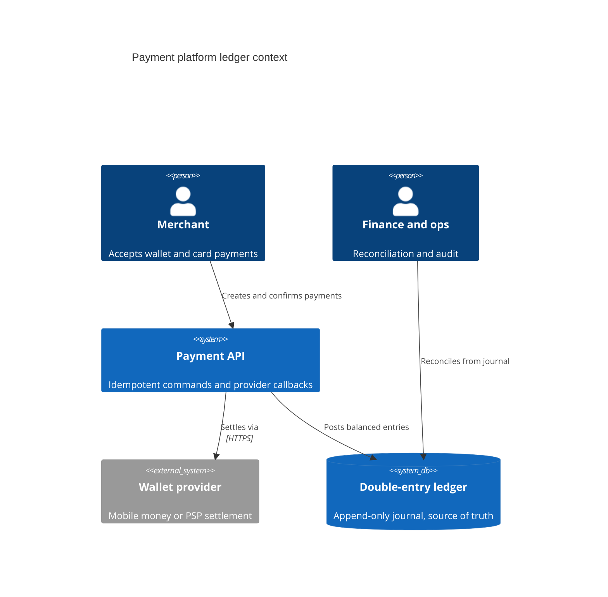

Mutable balances are attractive because they are simple to query. They are also dangerous when money moves through retries, reversals, provider callbacks, and delayed settlement. The moment finance asks why a balance changed, a single current-value table stops being enough.

## System context

<Adr
  status="Accepted · 2025-04-12"
  context="The payment platform must support wallet integrations, provider callbacks, refunds, partner settlement, and finance reconciliation. Auditors need an immutable trail for every posted movement."
  decision="Use a double-entry ledger with append-only postings. Every movement creates balanced debit and credit entries inside a transaction; derived balances can be cached, but the journal remains the source of truth."
  consequences="Positive: reconciliation and audit become explainable from data. Negative: engineers must model accounting events explicitly, and write paths need stronger transactional discipline."
/>

<Drawio
  src="/diagrams/double-entry-ledger-context.drawio"
  title="Journal vs projections"
  caption="The ledger journal is the source of truth. Balance views and caches are derived read models, never the authority for posted money."
/>

<Callout variant="warning">
  A ledger is not a reporting feature. It is the contract that lets product,
  finance, support, and compliance agree on what happened to money.
</Callout>
