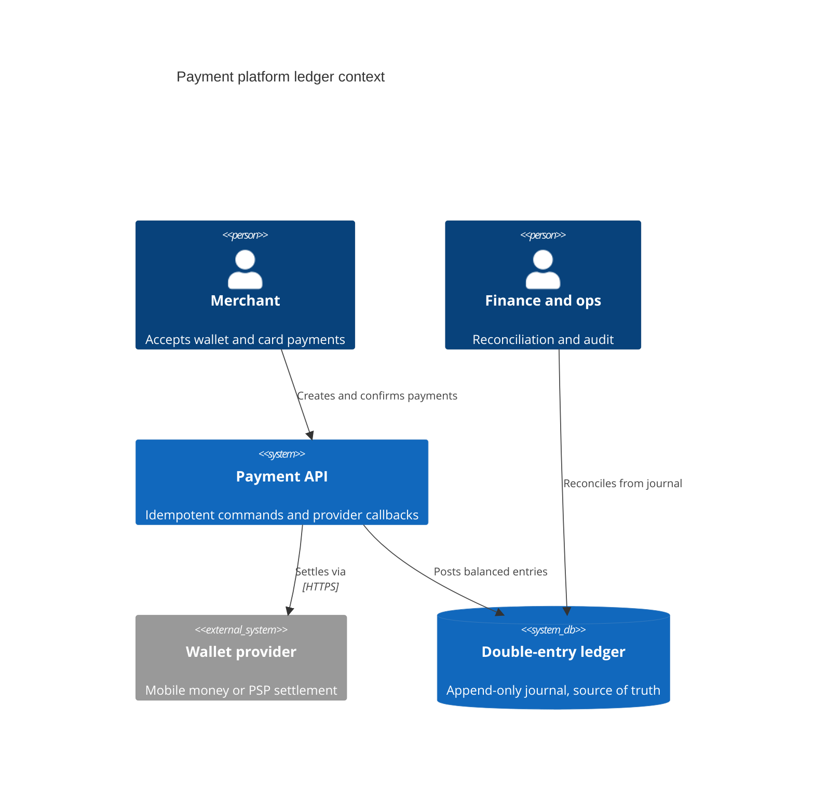

Mutable balances are attractive because they are simple to query. They are also dangerous when money moves through retries, reversals, provider callbacks, and delayed settlement.

The moment finance asks why a balance changed, a single current-value table stops being enough.

## System context

```mermaid
C4Context
  title Payment platform ledger context
  Person(merchant, "Merchant", "Accepts wallet and card payments")
  Person(ops, "Finance and ops", "Reconciliation and audit")
  System(payment_api, "Payment API", "Idempotent commands and provider callbacks")
  System_Ext(wallet, "Wallet provider", "Mobile money or PSP settlement")
  SystemDb(ledger, "Double-entry ledger", "Append-only journal, source of truth")
  Rel(merchant, payment_api, "Creates and confirms payments")
  Rel(payment_api, wallet, "Settles via", "HTTPS")
  Rel(payment_api, ledger, "Posts balanced entries")
  Rel(ops, ledger, "Reconciles from journal")
```

## Decision

<Adr
  status="Accepted · 2025-04-12"
  context="The payment platform must support wallet integrations, provider callbacks, refunds, partner settlement, and finance reconciliation. Auditors need an immutable trail for every posted movement."
  decision="Use a double-entry ledger with append-only postings. Every movement creates balanced debit and credit entries inside a transaction; derived balances can be cached, but the journal remains the source of truth."
  consequences="Positive: reconciliation and audit become explainable from data. Negative: engineers must model accounting events explicitly, and write paths need stronger transactional discipline."
/>

<Drawio
  src="/diagrams/double-entry-ledger-context.drawio"
  title="Journal vs projections"
  caption="The ledger journal is the source of truth. Balance views and caches are derived read models, never the authority for posted money."
/>

## Why not a balance column?

| Approach | Looks good for | Breaks when |
| --- | --- | --- |
| Mutable `balance` | Demo dashboards | Retries, partial refunds, disputes |
| Event log without double-entry | Analytics | Debits without matching credits |
| Double-entry journal + projections | Audit + scale | Requires accounting literacy up front |

With double-entry:

- every movement is **balanced** (debits = credits)
- history is **append-only**
- balances are **derived**, never authoritative alone
- "why did this change?" is a journal query, not archaeology

<Callout variant="warning">
  A ledger is not a reporting feature. It is the contract that lets product,
  finance, support, and compliance agree on what happened to money.
</Callout>

## Revisit when

Reopen this ADR if:

- you introduce multi-currency positions that need explicit FX events
- regulators require a different audit export format
- write latency on the journal becomes a measurable product constraint (then optimize projections — do not abandon the journal)

## Bottom line

Correctness first. Speed of "UPDATE balance" second. The expensive bug is the one finance cannot explain.

> **Caches show money. The journal proves money.**
