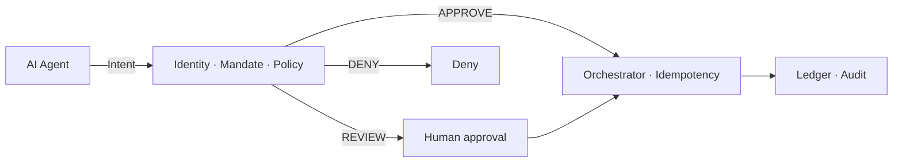

On July 24, 2026, Visa and Lianlian DigiTech [announced a B2B purchase completed by LoopXPay](https://www.prnewswire.com/apac/news-releases/visa-and-lianlian-advance-trusted-b2b-agentic-commerce-through-loopxpays-first-live-b2b-agentic-transaction-302833916.html): source, order, pay — in one workflow, under predefined spend controls.

The product story is autonomy. The architecture story is authority.

Calling a payment API is easy. Building a system where an agent can be **identified, mandated, limited, revoked, and audited** is the real work.

## The shift that matters

```text
AI recommends → Human decides → System executes
AI proposes    → System authorizes → System executes
```

That second path looks like progress. Without a trust boundary, it is just a probabilistic model with access to money.

A payment stack must now answer more than "who is the user?":

- which **agent** is acting?
- for which **principal**?
- under which **mandate**?
- within which **limits**?
- with what **proof**?

<Callout variant="warning">
  Model confidence is not authorization. A persuasive answer is neither a
  mandate nor proof that funds should move.
</Callout>

## Intent in, money out

The agent should never call the rail directly. It should emit a structured **payment intent**. Deterministic infrastructure decides whether that intent is authorized.



Core contract:

> **The agent proposes. The system authorizes. Only then does money move.**

## What the trust layer must own

| Concern | Design rule |
| --- | --- |
| **Identity** | Agent ≠ principal. Short-lived credentials, immediate revocation. |
| **Mandate** | Specific, limited, time-bound, non-transferable, versioned. |
| **Policy** | Deterministic rules with reason codes — independent of the LLM. |
| **Autonomy** | Auto / review / block by risk — humans approve exceptions, not every payment. |
| **Idempotency** | Ten retries = one economic intent. Ambiguous PSP responses → status check, never a new debit. |
| **Audit** | Decision lineage: principal → agent → mandate → policy → payment → ledger. |

Handing an agent the CFO's bank credentials is not delegation. It deletes the boundary you will need in the dispute, the audit, and the incident review.

## Where this gets hard in Africa

Multi-rail stacks — banks, mobile money, wallets, instant payments — make agent procurement powerful. They also multiply failure modes: rail switches, incomplete callbacks, and statuses that are not interchangeable (`SUCCESS` ≠ `SETTLED`).

The hard problem is not whether an LLM can orchestrate the steps. It is whether the infrastructure can absorb retries, timeouts, and bad judgments **without turning autonomy into financial risk**.

## Bottom line

The next competitive layer in payments is not a smarter model. It is a **trust layer** between intelligence that wants to act and rails that move cash.

> **AI can decide a payment is necessary. It should never decide alone that it is authorized.**

Would you hand an agent a budget today — and how narrow would its mandate be?
