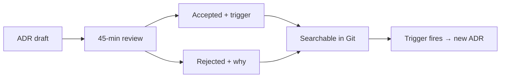

Reviews derail when the room optimizes for **being seen** as smart instead of **reducing** risk. The output is a calendar invite and a vague sense of unease — not a decision that survives the next hiring wave.

A useful review is short, adversarial in the right way, and ends with owners and dates.

## What a bad review produces

- Diagrams nobody owns
- "We should look into X" with no owner
- Consensus that evaporates when the first incident hits
- No record a new hire can read in twenty minutes

If the meeting cannot leave behind a searchable decision, it was theatre.

## The contract: one-page ADR

<Adr
  status="Accepted · 2024-12-05"
  context="Engineering squads were spending half-day sessions in architecture forums that produced no recorded decision. Product needed faster alignment on trade-offs (latency vs. cost vs. compliance) without escalating every choice to a committee."
  decision="Adopt a one-page ADR per material decision: context (with links), decision, consequences (positive and negative), and a single explicit revisit-when trigger (metric threshold, date, or regulatory event). Reviews longer than 45 minutes are split or cancelled."
  consequences="Positive: decisions are searchable in Git; new hires read history instead of lore. Negative: requires discipline to update status when assumptions change; accepted is not forever without a trigger."
/>

## How to run the room

| Role | Job |
| --- | --- |
| **Author** | Ships the draft ADR 24h before; owns the decision |
| **Sceptic** | Attacks assumptions, not people |
| **Facilitator** | Timeboxes; kills slide sprawl |
| **Scribe** | Updates status and follow-ups in the same PR |

Rules that keep reviews useful:

1. **Published agenda** — three questions max: what, why, reopen when.
2. **45 minutes or less** — split or cancel; do not stretch for politics.
3. **Follow-ups fit the next sprint** — parking lots that never land are debt with a smile.
4. **Revisit triggers are mandatory** — "accepted" without an exit condition is dogma.

<Callout variant="info">
  Good ADRs answer three questions: what did we decide, why, and what would
  make us reopen the discussion? If any answer is missing, the review is not
  done.
</Callout>

## Bottom line

This format scales from seed-stage teams to multi-line orgs because it optimizes for **clarity and memory**, not slide count.

> **An architecture review that does not leave a decision in Git did not happen.**
