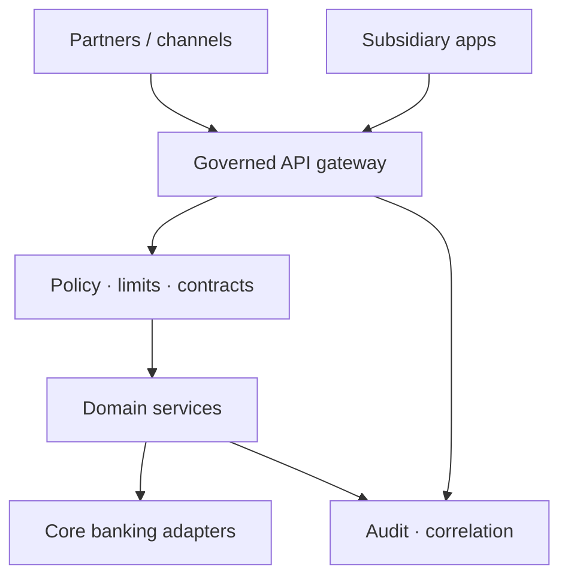

A multi-subsidiary bank does not need another thin API layer. It needs a **controlled boundary** between fragile core systems, fast-moving product teams, and external partners.

The middleware must normalize identity, contracts, rate limits, audit trails, and operational visibility — without becoming a dumping ground for every exception.

## Start from governance, not endpoints

The first design decision is ownership:

- who can **publish** an API?
- who approves a **breaking** change?
- where does the **canonical OpenAPI** live?

Once that is explicit, the gateway can enforce versioning, authentication, input validation, and request correlation **before** traffic reaches domain services or the core banking adapter.

<Callout variant="info">
  A banking middleware succeeds when incidents become traceable: partner
  request → gateway decision → domain event → core response → audit record
  share one correlation story.
</Callout>

## Design for subsidiary variance

Subsidiaries rarely share identical rules: limits, compliance checks, partner SLAs, and settlement windows differ. Keep those differences in **policy and configuration**, not in forked services.

| Shared platform core | Local / subsidiary policy |
| --- | --- |
| AuthN / AuthZ patterns | Limit matrices, KYC depth |
| Correlation + audit schema | Settlement calendars |
| Contract versioning | Partner allowlists |
| Observability standards | Escalation SLAs |

The architecture should make local rules explicit while preserving one platform spine.

<Drawio
  src="/diagrams/banking-middleware-platform.drawio"
  title="Platform boundary"
  caption="Partners and subsidiaries share a governed gateway, policy layer, and audit trail before domain services or core banking adapters."
/>

## What the middleware must own

1. **Identity boundary** — partner credentials ≠ core credentials; short-lived tokens; revocation that actually works.
2. **Contract boundary** — versioned OpenAPI; no silent field semantics drift.
3. **Money observability** — every debit attempt has a correlation id that finance and ops can follow.
4. **Failure policy** — timeouts, retries, and circuit breakers defined once, not per squad.

Handing product teams raw core credentials is not velocity. It deletes the boundary you will need in the incident review and the regulator visit.

## Bottom line

Middleware that only "exposes APIs" becomes a liability. Middleware that **governs money-touching traffic** becomes the bank's operating system for change.

> **Protect the core. Configure the variance. Trace every request that can move money.**
