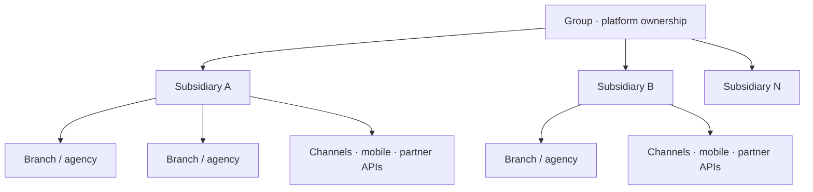

A banking group wants one platform for deposits, payments, and agency operations — not eleven separate cores to keep alive. Each subsidiary still has its own legal entity, currency, product catalogue, and regulator. Each branch is an operating point with cash, limits, and staff — not a bank of its own.

Centralized Banking-as-a-Service only works when that hierarchy is modeled on purpose: **one shared platform contract**, many subsidiary realities, thousands of branch contexts that never leak into each other.

## What “centralize” actually means

Centralize the **platform**: APIs, ledger engines, identity, orchestration, observability, release trains.

Do **not** centralize risk, compliance, or balances into a single undifferentiated blob. A shared codebase with first-class entity boundaries is not the same as a shared database where every subsidiary’s money sits behind the same `WHERE` clause.

| Centralize | Keep local |
| --- | --- |
| API contracts & release trains | Chart of accounts, currency |
| Ledger engine (code) | Ledger data (per entity) |
| Identity patterns & audit schema | Branch limits, vault hierarchy |
| Observability standards | Regulatory reporting calendars |

The group buys speed and consistency; each subsidiary keeps its legal and operational perimeter.

## The hierarchy you must model

- **Group** — shared platform ownership, standards, cross-entity reporting, partner contracts at scale
- **Subsidiary** — legal entity: chart of accounts, currency, local products, regulatory reporting, settlement calendars
- **Branch / agency** — service point: cash vault, teller roles, local limits, opening hours, device inventory
- **Channels** — mobile, agency banking, partner APIs: same domain commands, different auth and risk envelopes

## Architecture pillars of multi-subsidiary BaaS

1. **Tenancy first** — every command, event, and row carries an explicit `entityId`; isolation is a product feature, not an afterthought filter.
2. **Ledger per subsidiary** — balances and double-entry books never cross legal entities; group views are aggregations, not a mega-ledger.
3. **Parametric product catalogue** — shared primitives (account, transfer, fee) with local rules, limits, and fees instead of forked services.
4. **Identity and branch scope** — a teller sees one agency; a subsidiary ops role sees one entity; group roles are rare and audited.
5. **Dual reporting** — regulatory and financial close per subsidiary, plus group consolidations that never weaken entity controls.

<Callout variant="warning">
  The expensive failure mode is a “shared database without boundaries,” or
  eleven forks of the same core “just for this market.” Both look faster in
  month one. Both become unreleasable by year two — especially across West
  African multi-country groups where each subsidiary already runs a different
  operating reality.
</Callout>

## Branches inside a centralized platform

Branches are **configuration and authorization**, not separate deployments. Cash limits, vault hierarchies, teller workflows, cut-off times, and device inventories belong in subsidiary-scoped policy layers.

The platform ships one release train; each agency inherits the subsidiary’s rules and adds local constraints. When a teller posts a deposit, the command is the same everywhere — **entity, branch, and channel** travel with it so audit, reconciliation, and support never guess which perimeter they are in.

This is the same stance as [banking middleware for multi-subsidiary orgs](/articles/banking-middleware-multi-subsidiary): govern once, configure variance, never fork the spine.

## Bottom line

Multi-subsidiary BaaS is not “the same core eleven times.” It is one platform contract and N operating realities.

> **Design for variance from entity two and branch one — or you will pay for it in forks, incidents, and regulatory gaps later.**
