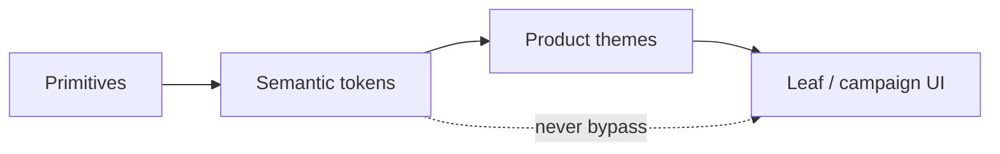

When every squad invents a slightly different shade of "primary" for a landing page, you do not have a design system. You have a colour zoo.

The boundary is not "design vs code." It is **semantic stability** vs **contextual expression**.

<DesignNote>
  **Principle:** Keep **semantic** tokens (e.g. `--surface-elevated`,
  `--text-muted`, `--focus-ring`) owned by the design system. Let **product**
  layers compose those tokens into gradients, campaign skins, or seasonal
  accents only at **leaf** components — never by forking the core button or
  input primitives.
</DesignNote>

## Two layers, one contract

| Layer | Examples | Who owns | May change for a campaign? |
| --- | --- | --- | --- |
| **Semantic** | `--text-primary`, `--danger`, `--focus-ring` | Design system | No |
| **Product / leaf** | Hero gradient, seasonal badge fill | Product design | Yes |

Product skins must compose semantics. They must not redefine the button primitive's contrast contract.

## Handoff checklist

- Name tokens after **role** (what they do), not after hex or Figma layer names.
- Document dark-mode pairs next to light in the **same** table — drift hides in separate tables.
- Ship a JSON (or CSS variables) export that **byte-for-byte** matches what the app consumes.
- Define focus, contrast, and motion rules at the system level — product skins must not weaken WCAG-critical paths.
- Version the token package; breaking renames need a migration note, not a Slack surprise.

<Callout variant="warning">
  If a "brand refresh" requires touching fifty primitives, your tokens were not
  semantic — they were aliases to a single palette.
</Callout>

## The third theme nobody named

When Figma and production diverge, the bug is usually an **implicit third theme** — dark mode, high-contrast, or "marketing only" — that nobody put in the contract between design and engineering.

Name it. Version it. Test it with the same contrast rules as the default theme.

## Bottom line

Tokens are governance for visual language. Without a boundary, every launch invents a new system.

> **Semantic tokens are infrastructure. Campaign colour is decoration. Never let decoration rewrite infrastructure.**
