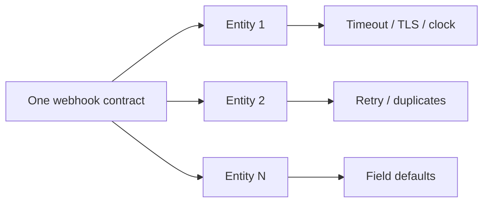

One subsidiary, one webhook endpoint, one happy path — it works first try, and it is tempting to ship the same contract everywhere.

Multiply that endpoint by eleven banking entities with their own infrastructure, their own security policy, and their own idea of “timely,” and the contract that looked airtight in staging starts leaking in ways no single-tenant test would ever catch.

## The failure modes that only appear at N entities

| Failure mode | Why staging missed it |
| --- | --- |
| Timeout budgets differ per subsidiary firewall | Staging used one network path |
| TLS / cert rotation not synchronized | “Broke last night” is a different night per entity |
| Clock skew fails signature windows | Lab clocks were NTP-clean |
| Duplicate delivery under aggressive retries | Load + entity-specific queue policy |
| “Optional” field interpreted differently | One team filled a spec gap with a local default |

<Callout variant="warning">
  None of these are exotic bugs. Each one is boring in isolation — and
  invisible until entity number seven or eight surfaces it in production,
  usually during a settlement window.
</Callout>

## Design for variance, not for a single golden entity

The fix is not a smarter retry library. It is treating **per-entity configuration** as a first-class part of the architecture from entity two onward:

1. **Explicit timeout budgets** per subsidiary — measured, not copied from the golden entity.
2. **Idempotency keys** that survive duplicate delivery by design — not regenerated on each attempt.
3. **Signature verification** with a tolerant clock window — and monitoring for skew that exceeds it.
4. **Correlation IDs** that tie a webhook to the entity, the attempt number, and the exact contract version it was signed against.

This pairs with the callback discipline in [mobile money integration patterns](/articles/mobile-money-integration-patterns): verify, then transition; never assume one happy path.

## What to instrument from day one

- Per-entity success / latency / duplicate rates on the same contract version
- Alert when one subsidiary’s p99 diverges sharply from the group median
- Contract version stamped on every outbound signature and inbound audit row

Without that, “the webhook is flaky” becomes tribal knowledge instead of an ops signal.

## Bottom line

Multi-subsidiary integration work is not “the same webhook eleven times.”

> **One contract. Eleven operating realities. Zero forks of the code — variance lives in configuration.**
