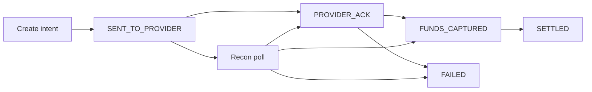

Mobile money rails in West Africa are not uniform. Wave, Orange Money, and Free Money each expose different callback semantics, settlement windows, and retry behaviours.

A payment marked `SUCCESS` by the provider is not always a settled transaction. Building as though it is will surface as a reconciliation nightmare six months into production. The sharper vocabulary lives in [when SUCCESS is not settled](/articles/when-success-is-not-settled) — this article is the integration pattern that prevents the trap.

## Decouple initiation from confirmation

Most providers deliver a webhook asynchronously — sometimes seconds later, sometimes minutes, occasionally never if your endpoint was down.

Your architecture must:

1. Store the **intent** immediately on initiation.
2. Update state only after a **verified** callback (or status poll).
3. Run reconciliation for intents still pending past the provider SLA.

## Map provider codes — do not mirror them

Never set `settledAt` on the first `SUCCESS` callback. Map provider vocabulary into an internal state machine that finance, support, and product can share.

<CodeBlock title="Callback handler — verify, map, transition">{`public enum InternalPaymentState {
  INITIATED, SENT, PROVIDER_ACK, FUNDS_CAPTURED,
  SETTLED, FAILED, EXPIRED
}

@Transactional
public PaymentIntent handleCallback(CallbackPayload payload) {
  verifyHmac(payload); // reject spoofed SUCCESS

  PaymentIntent intent = repository
    .findByProviderRef(payload.getReference())
    .orElseThrow(() -> new UnknownReferenceException(payload.getReference()));

  if (intent.isTerminal()) {
    return intent; // idempotent no-op
  }

  ProviderStatus mapped = adapter.mapStatus(payload.getCode());
  switch (mapped) {
    case ACCEPTED -> intent.transition(PROVIDER_ACK);
    case DEBITED -> intent.transition(FUNDS_CAPTURED);
    case SETTLED -> intent.transition(SETTLED);
    case FAILED -> intent.transition(FAILED);
    default -> auditLog.unknown(payload);
  }

  auditLog.record(intent, payload.getRawBody());
  return repository.save(intent);
}`}</CodeBlock>

<Callout variant="warning">
  Always verify the callback signature against the provider HMAC key before
  updating state. Spoofed callbacks that mark SUCCESS without settlement are a
  real attack vector.
</Callout>

## Reconciliation as a first-class job

| Cadence | Scope | Action |
| --- | --- | --- |
| Every 5 min | Active intents past SLA | Poll provider status API |
| Hourly / daily | Prior-day batch | Match settlement file rows |
| Manual queue | `UNKNOWN` after N polls | Never auto-success |

Treat divergence as an **alert**, not a spreadsheet surprise.

## Provider variance you must design for

| Concern | What varies | Design rule |
| --- | --- | --- |
| Callback timing | Seconds → never | Intent first; recon closes gaps |
| Status names | `SUCCESS` ≠ settled | Internal enum + adapter table |
| Settlement | Instant float vs T+1 CSV | Separate `FUNDS_CAPTURED` / `SETTLED` |
| Retries | Client + provider | Idempotency key on initiation |

## Bottom line

The systems that scale to millions of transactions without breaking finance are not the ones with the fastest provider SDKs. They are the ones where every money state is **explicit, observable, and recoverable** without manual heroics.

> **Integrate the rail. Own the state machine. Let reconciliation — not optimism — close the loop.**
