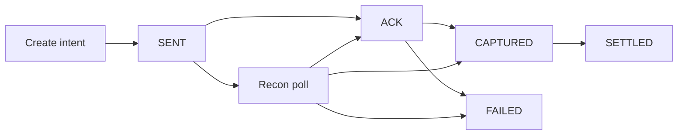

[The callback that said SUCCESS](/articles/when-success-is-not-settled) is the vocabulary. This is the machine.

A provider status is not a business status. It is an event to interpret. The handler that copies `SUCCESS` into `settledAt` is Monday morning.

Mobile money rails in West Africa are not uniform. They do not share a dictionary, a settlement window, or a retry behaviour. Your domain must.

## Three facts, not three translations

These are not labels for the same moment:

**ACK** — the rail received or accepted the request.
**CAPTURED** — value actually moved: debit or credit.
**SETTLED** — finance recognizes the row in settlement or reconciliation.
**FAILED** even if an earlier callback announced success.

Show the user ACK or CAPTURED. Post to the ledger at CAPTURED or at SETTLED — **one policy, formally documented**. Mix them, and the settlement file will not match the app.

Never set `settledAt` on the first callback.

## Decouple initiation from confirmation

Most providers deliver a webhook asynchronously — seconds later, minutes later, occasionally never if your endpoint was down. Webhooks also arrive twice, late, or out of order. That is normal. Treating the first packet as truth is not.

Your architecture must:

1. Store the **intent** immediately on initiation.
2. Update state only after a **verified** callback — or a status poll.
3. Run reconciliation for intents still pending past the provider SLA.

## Map the event — do not copy the word

Each rail gets an adapter. The adapter owns that rail's contract. The handler never reads `SUCCESS`.

<CodeBlock title="Callback handler — verify, interpret, transition">{`public enum InternalPaymentState {
  INITIATED, SENT, ACK, CAPTURED, SETTLED, FAILED, EXPIRED
}

@Transactional
public PaymentIntent handleCallback(CallbackPayload payload) {
verifyHmac(payload);

PaymentIntent intent = repository
.findByProviderRef(payload.getReference())
.orElseThrow(() -> new UnknownReferenceException(payload.getReference()));

if (!intent.canAdvance()) {
auditLog.duplicateOrStale(intent, payload);
return intent; // persist the raw body; never rewind
}

Fact fact = adapterFor(payload.getRail()).interpret(payload);
switch (fact) {
case ACK -> intent.transition(ACK);
case CAPTURED -> intent.transition(CAPTURED);
case SETTLED -> intent.transition(SETTLED);
case FAILED -> intent.transition(FAILED);
case UNKNOWN -> auditLog.unknown(payload); // recon will poll
}

auditLog.record(intent, payload.getRawBody());
return repository.save(intent);
}`}</CodeBlock>

`interpret()` is where the dictionary lives. On one rail, `SUCCESS` is ACK. On another it is CAPTURED. On a third it is only an intermediate state. The word is not the moment — the adapter is.

Transitions are **monotonic**. ACK may become CAPTURED or FAILED. CAPTURED does not become ACK because a late webhook arrived out of order.

<Callout variant="warning">
  Verify the callback signature against the provider HMAC key before any
  transition. A spoofed SUCCESS that your handler copies into the ledger is not
  a mapping bug. It is an attack.
</Callout>

## Reconciliation as a first-class job

The missed `FAILED`, the webhook that never landed, the status API still saying success while settlement is pending — none of that is an incident if recon is a job.

| Cadence        | Scope                   | Action                     |
| -------------- | ----------------------- | -------------------------- |
| Every 5 min    | Active intents past SLA | Poll the status API        |
| Hourly / daily | Prior-day batch         | Match settlement file rows |
| Manual queue   | `UNKNOWN` after N polls | Never auto-success         |

Treat divergence as an **alert**, not a spreadsheet surprise. Reconciliation closes a gap. It does not create francs.

## What must vary — without copying a spec

| Concern         | What varies                     | Design rule                          |
| --------------- | ------------------------------- | ------------------------------------ |
| Callback timing | Seconds → never                 | Intent first; recon closes gaps      |
| Status names    | Same word, different fact       | Per-rail adapter; internal enum      |
| Delivery        | Duplicate, missed, out of order | Idempotent handler; monotonic states |
| Settlement      | Instant float vs T+1 file       | Separate CAPTURED from SETTLED       |
| Retries         | Client + provider               | Idempotency key on initiation        |

Retries are the next failure mode. Timeout is not permission to debit again — that pattern is in [the retry storm that almost paid a merchant twice](/articles/retry-storm-double-payout).

## Bottom line

The systems that survive production are not the ones with the fastest provider SDK. They are the ones where every money state is **explicit, observable, and recoverable** without a Monday hero.

> **A callback is a sentence in the provider's language. This handler is the translator. Reconciliation — not the first SUCCESS — closes the loop.**
