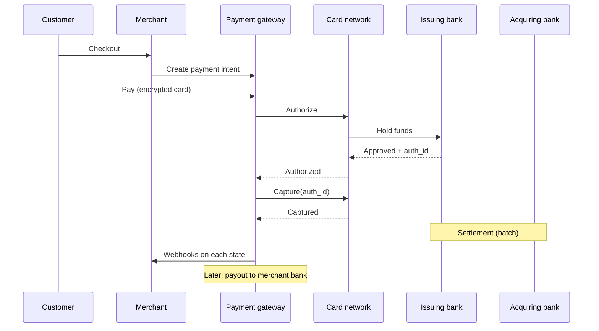
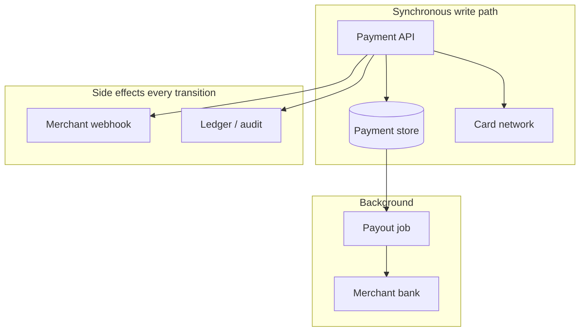
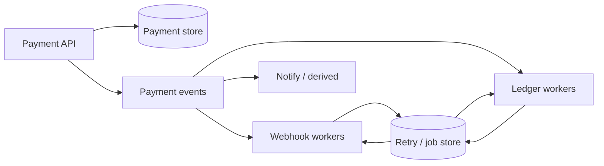

A payment gateway is not a bank. It is the licensed intermediary that moves money from a customer's card to a merchant's account — through card networks, acquiring banks, internal ledgers, webhooks, and delayed payouts.

Interview diagrams often stop at "call Visa." Production systems fail in the gaps: the API died before the ledger write, the merchant webhook was down for a day, or two retries both reached the network. This piece walks the full lifecycle — domain first, then a design that works for a few merchants, then the pieces that survive Stripe-scale load.

The vocabulary and failure modes map cleanly onto the same boundaries we use for mobile money in [scalable fintech systems](/articles/scalable-fintech-systems) and [the callback that said SUCCESS](/articles/when-success-is-not-settled).

## Domain: who moves the money

| Role                    | Who                 | Job                                              |
| ----------------------- | ------------------- | ------------------------------------------------ |
| **Merchant's customer** | Cardholder          | Pays for goods/services                          |
| **Merchant**            | Your customer       | Sells; receives payouts                          |
| **Payment gateway**     | You (Stripe-like)   | Intent, auth, capture, ledger, webhooks, payouts |
| **Issuing bank**        | Customer's bank     | Issued the card                                  |
| **Card network**        | Visa, Mastercard, … | Routes auth/capture between banks                |
| **Acquiring bank**      | Gateway's bank      | Receives funds from the network                  |
| **Ledger**              | Your books          | Balanced debit/credit for every movement         |

Why merchants use a gateway instead of wiring card networks themselves: licenses, PCI scope, network certification, and the fines when you get it wrong. The gateway's product is not "an API" — it is **regulated money movement with an audit trail**.

### Auth → capture → settlement

Card money does not move in one hop. Three stages matter:

1. **Authorization** — lock funds on the customer's account; fraud checks; may include 3-D Secure redirects (same shape as OAuth).
2. **Capture** — confirm the auth; the network commits to moving the money. Idempotent on the network side for a given `auth_id`.
3. **Settlement** — banks actually move balances between accounts (often batch, hours to days later).

A useful mental model: auth ≈ begin transaction, capture ≈ commit, settlement ≈ replication to the follower that finance trusts.



### Reconciliation is not optional

Banks compare ledgers with each other on a schedule because they talk asynchronously. Gateways must do the same — especially for **payouts**: internal ledger balances versus what actually landed in merchant bank accounts. Same discipline as matching mobile-money settlement files; different rails.

## Requirements

### Functional

- Merchant can register (profile, API keys, webhook URL + signing secret)
- Customers can pay for merchant goods/services
- Merchant receives webhooks on payment state changes
- Merchant receives money via **payout** to their bank account
- No double charge for the same payment intent
- Audit: every money-affecting event lands in a **ledger** (legal requirement)

### Non-functional (Stripe-shaped scale)

| Signal                | Order of magnitude                                      |
| --------------------- | ------------------------------------------------------- |
| Payment API           | ~10k rps at peak (hundreds of millions of requests/day) |
| Ledger / state events | ~100k rps at peak                                       |
| Merchants             | millions                                                |
| Spikes                | seasonal (Black Friday) and celebrity merchants         |

Consistency policy that usually wins interviews _and_ reality:

- **Strong consistency (linearizable)** on the payment hot path — no double charge
- **Eventual consistency** for merchant dashboards and some ledger projections
- **No data loss** on ledger entries
- Webhooks: **at-least-once**, with retries measured in days, not minutes
- Ledger invariant: debits and credits sum to zero

## Happy path on one box

Before sharding Kafka, make the money story correct on a single deployment.



### 1. Merchant registration

CRUD for merchant profile, webhook endpoint, and secrets. Sign outbound webhooks so merchants can verify authenticity. Issue API keys scoped to that merchant.

### 2. Customer pays

1. Merchant (or Checkout) creates a **payment** with status `new` — goods, amount, currency, merchant id.
2. Customer submits encrypted card data with that payment id.
3. API moves status toward authorization, calls the card network **Authorize**.
4. Persist `auth_id`, status `authorized`.
5. **Capture** (same request, or a background worker / merchant-triggered capture).
6. Persist `captured`.
7. Later, a payout worker batches successful captures and credits the merchant bank.

On every meaningful transition: emit a merchant webhook and append a ledger entry. Do not treat those as optional logging.

### 3. No double charge — CAS on status

Double charge under concurrency is the classic failure: client retries `POST /payments/:id/pay` while the first call is still authorizing.

Use compare-and-swap on status so only one winner talks to the network:

```sql
UPDATE payments
SET status = 'authorizing'
WHERE id = $id AND status = 'new';
-- proceed to Authorize only if rows_affected = 1

UPDATE payments
SET status = 'authorized', auth_id = $auth_id
WHERE id = $id AND status = 'authorizing';
```

Capture is idempotent at the network for a given `auth_id`, so safe retries are possible once you own that id. Same idea as the [retry storm that almost paid a merchant twice](/articles/retry-storm-double-payout): the business key (here, payment id + status machine) must survive timeouts.

<Callout variant="warning">
  If two threads both see status <code>new</code> and both call Authorize, you
  have already lost — unless the network itself deduplicates. Own the transition
  in your store before you leave your process boundary.
</Callout>

### 4. Ledger on every event

Every auth, capture, fee, refund, and payout posts balanced entries. The [double-entry ledger ADR](/articles/adr-double-entry-ledger-payments) is the contract: the journal proves money; dashboards only project it.

### Drawbacks of the single-box design

It works for demos and low traffic. It breaks on real operations:

- Payout acknowledged by the bank, worker dies before persistence → you do not know whether to retry
- Merchant API down for 24h → webhook "fire and forget" loses the event
- API dies after network capture, before ledger write → legal/audit gap
- Hot merchants and Black Friday → one Postgres primary will not hold 10k payment rps plus 100k ledger events

## Scale: side effects off the request path

Payment success has independent side effects: webhooks, ledger projections, notifications, analytics. They fail and delay independently. Put them behind a **message broker** (Kafka or equivalent) with dedicated workers per concern.



### Correctness under at-least-once

Workers die. Merchant endpoints return 500 for days. You cannot lose audit rows.

- Persist delivery attempts (webhook outbox / retry store) with backoff up to **~30 days** for merchant webhooks
- Ledger consumers retry until success — "at least once" with idempotent posting keys (payment id + event type + sequence)
- Duplicate delivery is fine; duplicate **economic** effect is not

### Sharding and derived stores

| Component             | Scale approach                                      | Notes                                                |
| --------------------- | --------------------------------------------------- | ---------------------------------------------------- |
| **Payment API**       | Stateless horizontal scale, multi-region LBs        | Easy                                                 |
| **Payment store**     | Shard by **payment id**                             | Avoids celebrity-merchant hotspots on the write path |
| **Merchant store**    | Shard by **merchant id**                            | Dashboard/query path; sync from payment events       |
| **Audit / ledger**    | Shard by payment id (or dedicated journal strategy) | Must not lose data; query patterns vary              |
| **Event queue**       | Partition by payment id                             | Ordering per payment                                 |
| **Workers**           | Scale with partitions                               | Stateless                                            |
| **Retry / job store** | Shard by job id; index by type                      | Background payouts and webhook retries               |

Sharding payments by payment id makes merchant dashboards a scatter/gather nightmare. Fix with **derived data**: stream payment updates into a merchant-sharded read model. Celebrity merchants get isolation (dedicated shards / rate limits).

### CAP choices that match the money

| Store              | Consistency               | Replication bias              | Why                                                            |
| ------------------ | ------------------------- | ----------------------------- | -------------------------------------------------------------- |
| **Payment store**  | Linearizable              | Consensus (Raft/Paxos family) | Hot path decisions; no stale "still `new`" reads               |
| **Merchant store** | Eventual                  | Leader–follower async OK      | Dashboard lag of minutes is product-tolerable                  |
| **Audit / ledger** | Durable, eventual         | Leaderless / multi-leader     | Must not lose entries; little concurrent update per row        |
| **Event queue**    | Quorum / replicated log   | Kafka-style ISR               | No silent drop of payment events                               |
| **Retry store**    | Durable, not linearizable | Leaderless / multi-leader     | At-least-once jobs; lost rows = lost money or silent merchants |

<Callout variant="info">
  Merchant dashboard data is not the source of truth for money. When product and
  finance disagree, the ledger and the payment store win — not the eventually
  consistent projection.
</Callout>

## Mapping to West African rails

Card networks are one rail. Wave, Orange Money, and Free Money are another. The **shape** of a good gateway does not change:

| Card gateway concept         | Mobile money analogue                                                                       |
| ---------------------------- | ------------------------------------------------------------------------------------------- |
| Payment intent + status CAS  | Idempotent debit command                                                                    |
| Auth / capture / settlement  | Accepted → funds captured → settled ([split states](/articles/when-success-is-not-settled)) |
| Webhook + 30-day retry       | Provider callbacks + your outbound partner webhooks                                         |
| Payout + bank reconciliation | Merchant settlement files + float reconciliation                                            |
| Ledger balanced entries      | Same — see the [ledger ADR](/articles/adr-double-entry-ledger-payments)                     |

Eleven subsidiaries with eleven webhook quirks is an operating problem on top of this contract — not a reason to skip the contract. See [eleven subsidiaries, eleven ways to break a webhook](/articles/eleven-subsidiaries-eleven-ways-to-break-a-webhook).

## What to defend in a design review

1. **Own the status machine** before calling external money APIs.
2. **Side effects are asynchronous** and retried; the request path stays short.
3. **Ledger durability** is a legal requirement, not a nice-to-have sink.
4. **Shard writes for evenness**, **project reads for query shape**.
5. **Strong consistency where double-spend lives**; eventual elsewhere with eyes open.
6. **Reconciliation closes the loop** between your books and banks — forever, not at launch.

## Bottom line

A payment gateway is a state machine, a ledger, and a delivery guarantee wrapped around someone else's money movement. Scale without those three just multiplies incidents.

> **Auth locks, capture commits, settlement settles, the ledger proves — and webhooks keep trying until the merchant's world matches yours.**
