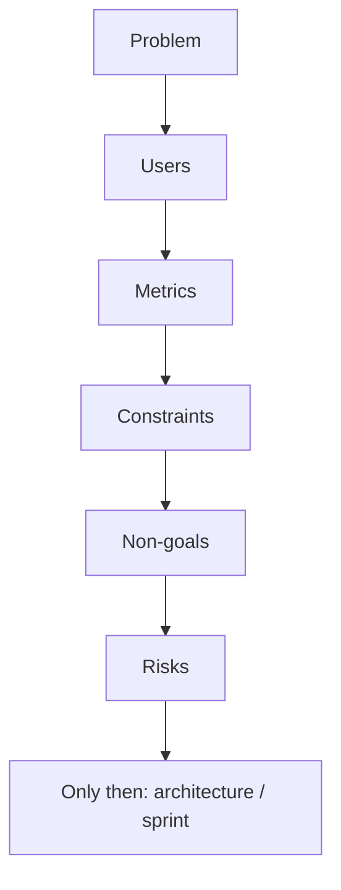

Use this outline in Confluence, Notion, or a Markdown file in the repo. The goal is a **shared vocabulary** and **testable assumptions** before architecture or sprint commitments.

If two readers disagree on what "success" means, stop. Clarify the brief first.

## The one-page outline

1. **Problem statement** — user pain + business pain in one paragraph. No solution yet.
2. **Target users** — personas or segments + primary jobs-to-be-done.
3. **Success metrics** — leading (activation, retention) and lagging (revenue, NPS) with rough targets.
4. **Constraints** — regulatory, SLA, budget, timeline, dependencies on other teams.
5. **Non-goals** — what is explicitly out of scope for this phase. Say no to scope creep early.
6. **Risks & open questions** — what must be validated before build; who owns each discovery item.

## How to use it in practice

| Anti-pattern | Better move |
| --- | --- |
| Brief is already a slide deck with diagrams | Write the problem in one sentence everyone can quote |
| Metrics are vanity counts | Pair leading + lagging with owners |
| Non-goals section empty | List the three tempting features you will refuse this phase |
| Risks owned by "the team" | One name per open question |

<Callout variant="warning">
  If the brief is already a slide deck with diagrams, you skipped the hard
  part — writing the problem in one sentence everyone can quote.
</Callout>

## Quality bar before kickoff

- [ ] Problem sentence fits in a Slack message without losing meaning
- [ ] At least one leading and one lagging metric named
- [ ] Three non-goals written (not implied)
- [ ] Each open question has an owner and a "decide by" date
- [ ] Constraints include the boring ones: compliance, settlement, support load

## Bottom line

Architecture without a brief invents requirements in the pull request. A one-page brief is cheaper than a quarter of thrash.

> **If you cannot say what you are not building, you have not decided what you are building.**
