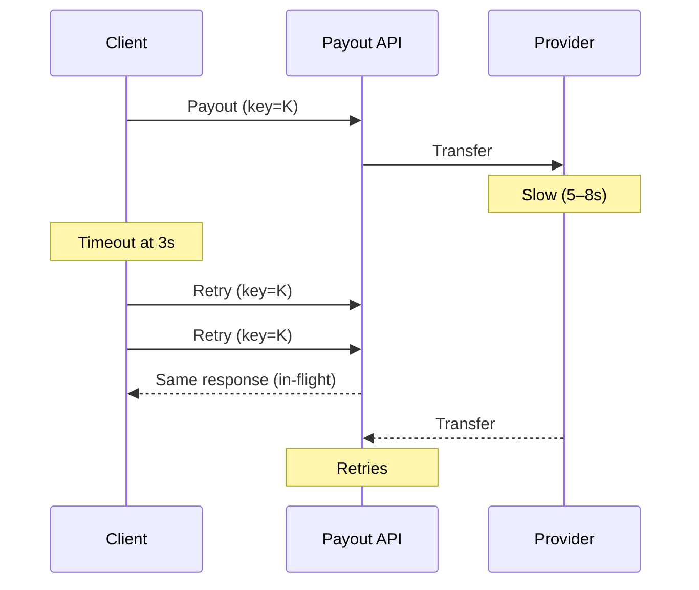

Finance never opened a ticket. Support never called the merchant. The only person who noticed was an engineer with coffee, reading a log line three requests wide.

That is the version that shipped. The version that almost shipped paid the same merchant **three times** for one sale.

[The callback that said `SUCCESS`](/articles/when-success-is-not-settled) lied with a word. This one lied with silence.

## Thursday, 16:47

A partner client submits a payout: **85,000 XOF**, one merchant, one order. The mobile money provider does not go down. It goes **slow** — four seconds, then five, then eight. Usual time is a few hundred milliseconds. The client's timeout is three seconds.

At 16:47:03 the client decides the first request failed.

It had not failed. It was still in the pipe.

The client fires the same payout again. Then again.

## What the client believed vs what was true

| What the client saw  | What was actually happening                  |
| -------------------- | -------------------------------------------- |
| Timeout at 3 seconds | The first transfer was still crawling (5–8s) |
| No response          | The provider was slow, not down              |
| Safe to retry        | The first request had already arrived        |

Within about ninety seconds the same payout command had been submitted **three times**. On the provider side, all three would have succeeded — three separate transfers, same amount, same recipient, one sale.

Finance would not have seen it that afternoon. They would have seen it in an end-of-day file — or days later — with no obvious trail back to a three-second timeout.

<Callout variant="warning">
  That is the trap with retries under latency, not downtime. Every signal a
  naive client looks at — timeout, no response, connection reset — looks exactly
  like “the request never arrived.” It usually did. It just had not answered
  yet.
</Callout>

## The idea in one sentence

**Idempotent** means: send the same money command twice, the money moves once.

Not “the API has a header.” Not “we log duplicates.” The economic fact happens **once**, even when the network answers with silence, a reset, or a late OK.

If you hire for payments, this is the judgment you want in the room: retries are inevitable; silence is not permission to move money again.

## The one check that held

The payout endpoint did not accept a random UUID. It required a key hashed from **merchant + order + amount** — the business intent, not a ticket the retry loop could mint again on every attempt.

All three retries carried the same key. The server recognized calls two and three as duplicates of a command already in flight, returned the original response, and never issued a second transfer.

| How you mint the key               | What a retry storm does                                           |
| ---------------------------------- | ----------------------------------------------------------------- |
| New UUID on every attempt          | Three transfers. Finance incident. Call to the merchant.          |
| Stable hash of the business intent | One transfer. A noisy log. Nobody in finance ever hears about it. |

| Who             | Without that key                                    | With it                                |
| --------------- | --------------------------------------------------- | -------------------------------------- |
| **Finance**     | Three credits for one sale, found at reconciliation | Nothing to explain                     |
| **Support**     | A merchant asking why they were paid twice          | No ticket                              |
| **Engineering** | An incident review                                  | One log line, noticed the next morning |

No refund. No awkward call. Just a slightly noisy log that a bored engineer read with coffee.

## The Friday that would have happened

If the key had been a fresh UUID on each retry, Thursday's payout would have landed three times. Friday's settlement file would have been “too right” — extra credits, not missing rows. Product would have called it a win. Finance would have called it a leak. Someone would have been on the phone with the merchant, explaining a refund for money they had already spent.

Same rails as the `SUCCESS` callback. Different lie: not a word, a gap.

The lesson was not “add retries carefully.” It was that idempotency has to be derived from the **business intent** of a command, not from a client-side identifier that a retry can accidentally reset.

Same rule as in [scalable fintech systems](/articles/scalable-fintech-systems): ten retries must equal **one** economic intent. If the key can change between attempts, the safety net was never actually there.

## Bottom line

> **Idempotency is not a header. It is a business key that must survive every timeout, every retry, and every eager client.**

## The rest of the pipe

A word lied. Silence lied. The next lie is a diagram that stops too early.

Thursday's key saved one payout. A gateway has to hold that same rule on every hop: auth, capture, settlement, ledger, webhook, payout. Each can timeout. Each can retry. Each can look finished while the money is still in flight.

Interview diagrams stop at "call Visa." The money is lost in the gaps.

**[From card tap to merchant payout →](/articles/payment-gateway-system-design)**
