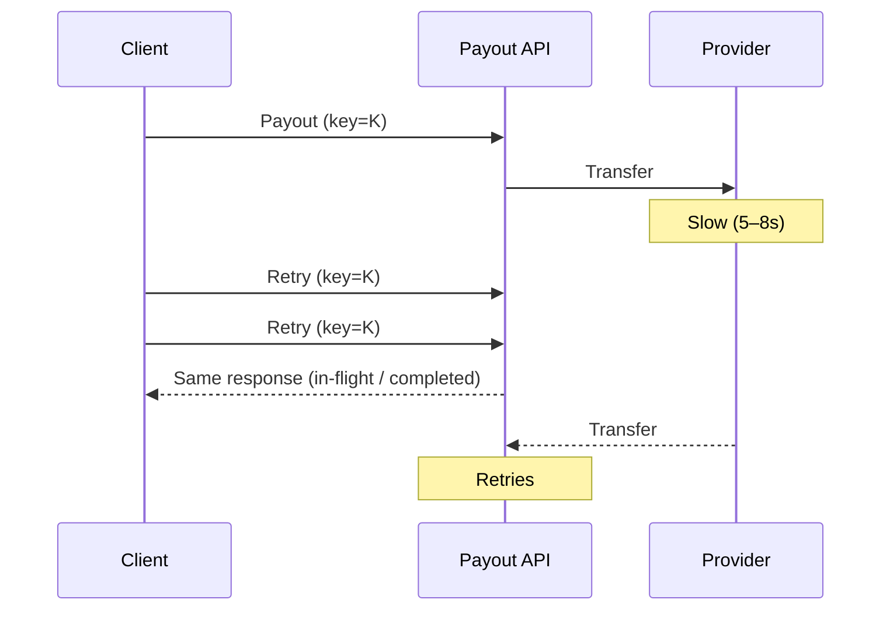

The callback lied with a word. This one lies with silence.

A mobile money provider went **slow, not down** — the worst kind of failure. Requests were taking four, five, sometimes eight seconds instead of the usual few hundred milliseconds.

A client integration with an eager retry policy started firing the same payout request again after a three-second timeout, still believing the first attempt had failed. It hadn't. It was just late.

## What actually happened

Within about ninety seconds, the same payout command had been submitted **three times** for the same merchant. On the provider side, all three eventually succeeded — three separate transfers, same amount, same recipient.

If the payments service had treated each inbound request as a new command, the merchant account would have been credited three times for one sale. Finance would have discovered it during end-of-day reconciliation — days later — with no obvious trail back to the cause.

<Callout variant="warning">
  That is the trap with retries under latency, not downtime: every signal a
  naive client looks at (timeout, no response, connection reset) is
  indistinguishable from “the request never arrived.” It usually did arrive.
  It just hadn't answered yet.
</Callout>

## The one check that held the line

The payout endpoint required a client-generated **idempotency key**, hashed from the merchant ID, the order ID, and the amount — not a random UUID the retry loop could regenerate on every attempt.

All three retries carried the same key. The server recognized the second and third calls as duplicates of an in-flight command, returned the original response, and never issued a second transfer.

| Key design | Outcome under retry storm |
| --- | --- |
| Random UUID per attempt | Three transfers · finance incident |
| Stable hash of business intent | One transfer · noisy logs only |

No incident, no reconciliation surprise, no call to the merchant to explain a refund. Just a slightly noisy log line, three requests wide, that a bored engineer noticed the next morning.

## What “idempotent” has to mean

The lesson wasn't “add retries carefully.” It was that idempotency has to be derived from the **business intent** of a command, not from a client-side identifier that a retry can accidentally reset.

Same rule as in [scalable fintech systems](/articles/scalable-fintech-systems) and [the callback that said SUCCESS](/articles/when-success-is-not-settled): retries are inevitable; ambiguous network answers are not permission to debit again.

If the key can change between attempts, the safety net was never actually there.

## Bottom line

> **Idempotency is not a header. It is a business key that must survive every timeout, every retry, and every eager client.**
