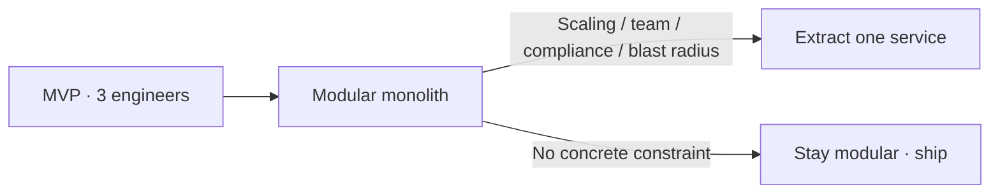

Every second architecture pitch for a new fintech MVP in the region starts with a service diagram: auth service, payments service, notifications service, a message bus between them, each with its own database and its own deploy pipeline.

The team behind it usually has **three engineers and no dedicated ops person**. That diagram is not an architecture — it is a wish list for a company that doesn't exist yet.

## Where the pattern comes from

Microservices-first is a reasonable answer to a problem most early fintechs in the region don't have yet: hundreds of engineers who need to deploy independently without stepping on each other.

Copying that structure at three engineers imports its costs:

| Cost you import | What you had before |
| --- | --- |
| Network calls | Function calls |
| Distributed transactions | Database transactions |
| Three pages at 2am | One process, one mental model |
| Per-service deploy pipelines | One release train |

<Callout variant="info">
  The question is never “monolith or microservices” in the abstract. It is:
  who is on call tonight, and how many independent failure domains can that
  person actually reason about at 2am?
</Callout>

## What actually justifies the split

Split a module out when a **concrete constraint** forces it — not when a blog post about Netflix does:

1. A module has a genuinely different **scaling profile** — e.g. webhook ingestion must scale independently of the admin dashboard.
2. Two teams need to ship and deploy that module on **separate schedules** without coordinating a release.
3. A component has different **compliance or data-residency** requirements from the rest of the system.
4. The module's failure **blast radius** must be contained — a reporting job crashing should never take payments down with it.

## Start modular, not distributed

Clear module boundaries, one deployable, one database, internal interfaces strict enough that pulling a module out later is a **refactor, not a rewrite**.

That is compatible with the money-discipline pieces elsewhere on this blog — [idempotent payment intents](/articles/scalable-fintech-systems), [ledger correctness](/articles/adr-double-entry-ledger-payments) — none of which require twelve repos on day one.

## Bottom line

None of the valid split criteria are “we read a blog post about Netflix.” Split when a concrete constraint forces it, not before.

> **The team that resists the diagram now is usually the one still shipping in eighteen months.**
