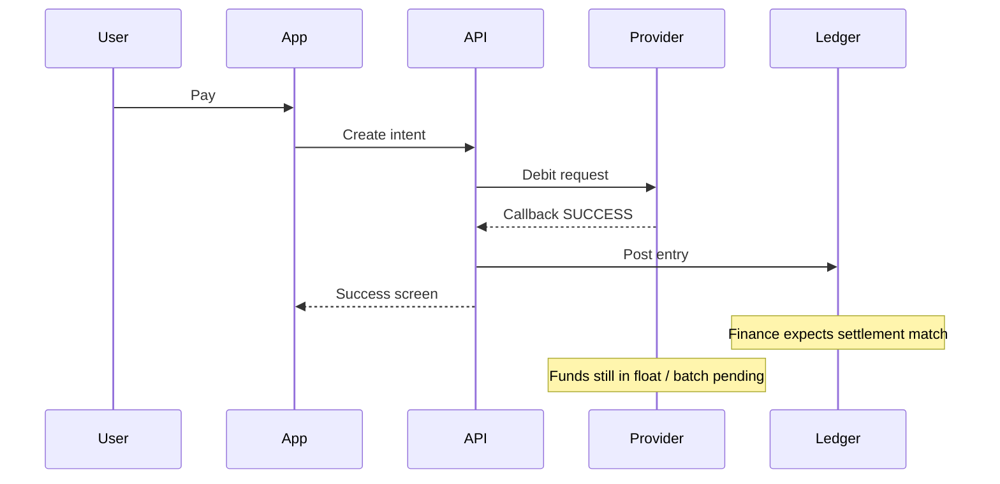
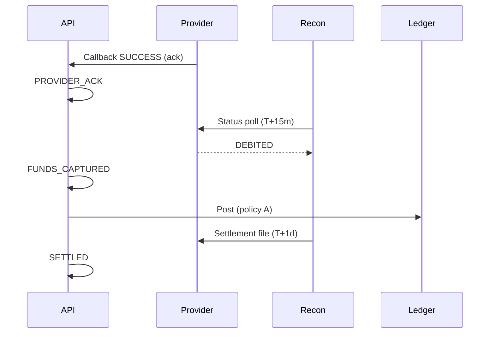

Finance opens the settlement file on Monday morning. Three rows from Friday's mobile money batch do not match the ledger. Support already closed the tickets — the app showed **Payment successful**. Product is asking why ops is "reopening" a green launch.

The provider was not lying. Your system mapped **`SUCCESS` to settled** when the provider only meant **accepted for processing**.

This is the most common reconciliation gap we see in West African fintech audits. It is also the direct sequel to [mobile money integration patterns](/articles/mobile-money-integration-patterns): same rails, sharper vocabulary.

## Three meanings hiding in one word

On paper, every provider exposes something like `SUCCESS`, `FAILED`, or `PENDING`. In production, teams discover at least three distinct moments:

| Moment        | What the provider often means              | What finance means                        |
| ------------- | ------------------------------------------ | ----------------------------------------- |
| **Accepted**  | Request received; debit may still fail     | Nothing yet — do not recognize revenue    |
| **Confirmed** | User wallet debited; funds in float        | Liability moves; still not bank-settled   |
| **Settled**   | Batch file / bank transfer closed the loop | Can match settlement report line-for-line |

Wave, Orange Money, and Free Money do not use the same names. Some send `SUCCESS` on the first callback and never send a second. Others send `COMPLETED` days later in a CSV. A few expose a status API where `SUCCESS` still returns `settlementStatus: PENDING`.

If your domain model has one boolean — `isSuccessful` — you will eventually lie to at least one audience.

## The sequence most teams assume



The bug is not the callback. The bug is **posting to the ledger on the wrong transition**.

## Split your states before you split your adapters

Replace a single `SUCCESS` with an internal vocabulary that survives provider renames:

```text
INITIATED → SENT_TO_PROVIDER → PROVIDER_ACK → FUNDS_CAPTURED → SETTLED
                                      ↘ FAILED
                                      ↘ EXPIRED / UNKNOWN (reconciliation)
```

Rules that hold across providers:

1. **User-visible copy** tracks `PROVIDER_ACK` or `FUNDS_CAPTURED` — never `SETTLED` unless you can defend it to finance.
2. **Ledger postings** happen at `FUNDS_CAPTURED` (wallet debited) or `SETTLED` (batch closed) — pick one policy and document it in an ADR. Mixing both without names is how disputes start.
3. **Reconciliation jobs** close the gap between `FUNDS_CAPTURED` and `SETTLED`; they do not invent money.

<CodeBlock title="Callback handler — map provider code, do not mirror it">{`public enum InternalPaymentState {
  INITIATED, SENT, PROVIDER_ACK, FUNDS_CAPTURED,
  SETTLED, FAILED, EXPIRED
}

public PaymentIntent handleCallback(CallbackPayload payload) {
PaymentIntent intent = loadOrThrow(payload.getReference());

if (intent.isTerminal()) {
return intent; // idempotent no-op
}

ProviderStatus mapped = adapter.mapStatus(payload.getCode());

switch (mapped) {
case ACCEPTED -> intent.transition(PROVIDER_ACK);
case DEBITED -> intent.transition(FUNDS_CAPTURED);
case SETTLED -> intent.transition(SETTLED);
case FAILED -> intent.transition(FAILED);
default -> auditLog.unknown(payload);
}

auditLog.record(intent, payload.getRawBody());
return repository.save(intent);
}`}</CodeBlock>

<Callout variant="warning">
  Do not set `settledAt` on `PROVIDER_ACK`. If your ORM has one timestamp field,
  rename it to `providerAckAt` or split columns now — before finance exports
  depend on the wrong semantics.
</Callout>

## Adapter table per provider (keep it boring)

Maintain a explicit mapping table — versioned, reviewed when providers change docs without announcement:

| Provider field                      | Your state       | Post to ledger? | Show user "success"? |
| ----------------------------------- | ---------------- | --------------- | -------------------- |
| `status=SUCCESS` (callback v1)      | `PROVIDER_ACK`   | No              | "Processing"         |
| `status=COMPLETED`                  | `FUNDS_CAPTURED` | Yes (policy A)  | "Paid"               |
| Settlement row present              | `SETTLED`        | Yes (policy B)  | unchanged            |
| Status API `PENDING` after callback | stay / `UNKNOWN` | No              | "Processing"         |

Policy A vs B is a business decision. The engineering requirement is **one documented choice**, not an implicit mix per sprint.

## What each team should see

**Support** needs provider reference, internal state, and last callback time — not a green checkmark borrowed from the app.

**Finance** needs a report keyed on `SETTLED` (or your chosen recognition point) with provider batch id.

**Product analytics** should funnel on `FUNDS_CAPTURED` if that is when the user experience completes — but label the metric honestly in the dashboard legend.

When these views diverge, incidents shrink from "who broke production?" to "which state is stuck?" — the difference between a week of Slack archaeology and a targeted reconciliation run.

## Reconciliation closes the loop

Schedule three tiers (from the [patterns article](/articles/mobile-money-integration-patterns)):

- **Hot path** — every 5 minutes, poll status for intents in `PROVIDER_ACK` or `FUNDS_CAPTURED` past the provider SLA.
- **Daily batch** — compare settlement file rows to `SETTLED`; alert on orphans in either direction.
- **Manual queue** — `UNKNOWN` after N polls; never auto-success.



## Checklist before the next provider

- [ ] Internal state enum reviewed with finance — not only backend
- [ ] Adapter mapping table in repo, not in one engineer's head
- [ ] User copy tested for `PROVIDER_ACK` vs `SETTLED`
- [ ] Ledger ADR says which transition posts entries
- [ ] Reconciliation alerts on stuck `FUNDS_CAPTURED`, not only `PENDING`
- [ ] Correlation id on callback, poll, and settlement row

<Callout variant="info">
  Related reflection: [The loneliness of the payment
  engineer](/articles/loneliness-of-the-payment-engineer) — why this vocabulary
  work feels invisible until month six.
</Callout>

---

**Case studies:** [Pan-African Payment SDK](https://saifcore.tech/en/systems) and [double-entry ledger](https://saifcore.tech/en/systems) on the portfolio. Stuck between provider docs and finance reports? [Book a 30-min architecture review](https://saifcore.tech/en#contact).
