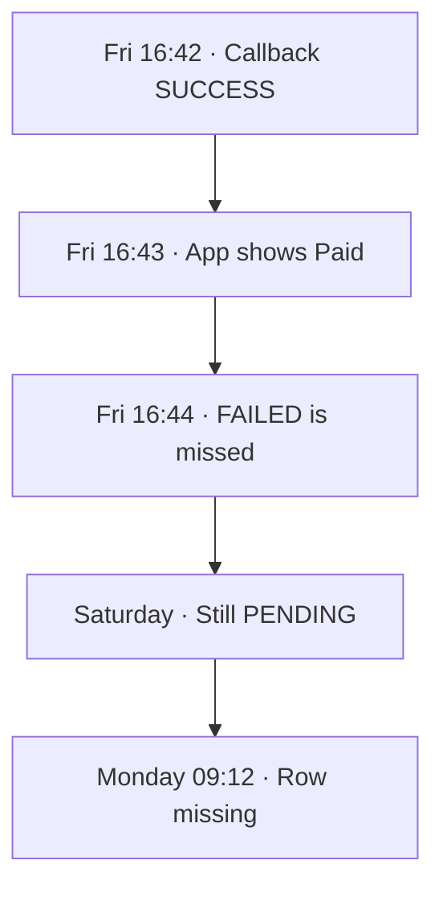
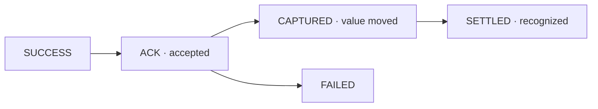

Finance opens the settlement file on Monday morning. Three rows from Friday's mobile money batch do not match the ledger. Support already closed the tickets — the app showed **Payment successful**. Product is asking why ops is "reopening" a green launch.

The provider was not lying. Your system mapped **`SUCCESS` to settled** when the provider only meant **accepted for processing**.

This is the most common reconciliation gap we see in West African fintech audits. It is also the direct sequel to [mobile money integration patterns](/articles/mobile-money-integration-patterns): same rails, sharper vocabulary.

## Three meanings hiding in one word

On paper, every provider exposes something like `SUCCESS`, `FAILED`, or `PENDING`. In production, teams discover at least three distinct moments:

| Moment        | What the provider often means              | What finance means                        |
| ------------- | ------------------------------------------ | ----------------------------------------- |
| **Accepted**  | Request received; debit may still fail     | Nothing yet — do not recognize revenue    |
| **Confirmed** | User wallet debited; funds in float        | Liability moves; still not bank-settled   |
| **Settled**   | Batch file / bank transfer closed the loop | Can match settlement report line-for-line |

Wave, Orange Money, and Free Money do not use the same names. Some send `SUCCESS` on the first callback and never send a second. Others send `COMPLETED` days later in a CSV. A few expose a status API where `SUCCESS` still returns `settlementStatus: PENDING`.

If your domain model has one boolean — `isSuccessful` — you will eventually lie to at least one audience.

## The sequence most teams assume

```mermaid
flowchart TB
  A["Fri 16:42 · Callback SUCCESS"] --> B["Fri 16:43 · App shows Paid"]
  B --> C["Fri 16:44 · FAILED is missed"]
  C --> D["Saturday · Still PENDING"]
  D --> E["Monday 09:12 · Row missing"]
```

## Monday, 09:12

Finance opened the batch file. `OM-88421` was not in it.

Here is what the weekend hid. Friday 16:44, a `FAILED` callback left the provider. Your endpoint was saturated: it never landed. Saturday, the status API still said success — settlement still pending. Nobody in ops checked — the ticket was already green.

Three systems, three truths. The app says paid. The provider says pending. The bank says nothing. The 15,000 XOF never moved.

Not an outage: a word that meant _accepted_, stored as _confirmed_, reported as _settled_.

<Callout variant="warning">
  Providers do not share a dictionary. A `SUCCESS` can mean a request accepted
  on one rail, a completed transfer on another, or only an intermediate state in
  a third system. The word is not the moment.
</Callout>

## Stop copying the word

The first `SUCCESS` is an **ACK**: the request was received. Processing. Not Paid.

A provider status is not a business status. It is an event to interpret.

These are not three translations of the same word. They are three different facts:

**ACK** — the provider received or accepted the request.
**CAPTURED** — value actually moved on the rail: debit or credit.
**SETTLED** — finance recognizes the row in settlement or reconciliation.
**FAILED** even if an earlier callback announced success.

```mermaid
flowchart LR
  CB["SUCCESS"] --> ACK["ACK · accepted"]
  ACK --> CAP["CAPTURED · value moved"]
  CAP --> SET["SETTLED · recognized"]
  ACK --> FAIL["FAILED"]
```

Show the user ACK or CAPTURED. Post to the ledger at CAPTURED or at SETTLED — **one policy, formally documented**. Mix them, and Monday morning starts again. Reconciliation closes a gap; it does not create francs.

Never set `settledAt` on the first callback. The handler that maps instead of copying is detailed in [mobile money integration patterns](/articles/mobile-money-integration-patterns).

## The Monday that should have happened

If Friday's `SUCCESS` had become ACK, the app would have said _Processing_. Support would have seen an active intent. The missed `FAILED` would have surfaced on the next poll. And Monday's file would have been accurate: no row, because nothing was captured.

Finance would not have been hunting a ghost in a green launch. They would have been handling one stuck payment.

Same rails. Same callback. Different dictionary.

> **A callback is a sentence in the provider's language. Your architecture must translate it before it becomes a financial fact.**

## The next lie

`SUCCESS` was the first lie. The next one will be a silence.

The provider did not go down: it went slow. Three seconds of silence — enough for an impatient client to retry, then retry again. Same merchant, same amount, three transfers in flight.

Ninety seconds from a double payout.

**[What stopped it →](/articles/retry-storm-double-payout)**
