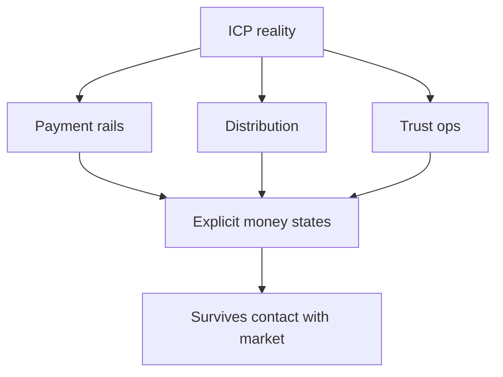

A playbook built for card-first economies, same-day logistics, and stable FX will mislead you the moment you optimize for a market where **mobile money**, **agent networks**, and **cash** still shape behaviour.

The roadmap is rarely the first thing that breaks. The invisible stack around it is: how money moves, how disputes resolve, and how trust is earned without a decade of brand history.

## The copy-paste trap

Teams that "copy San Francisco" under-index on last-mile reality:

| Assumption that travels poorly | What you actually meet |
| --- | --- |
| Cards are default | Mobile money, USSD, agent cash-in |
| Settlement is same-day | Float, batch files, corridor lag |
| KYC is uniform | Rules differ by country and partner |
| "SUCCESS" means paid | Often means accepted, not settled |
| Support scales with chat | Agents and field ops close the loop |

Partner APIs return success while the user's wallet is still pending. Settlement windows refuse to line up with payroll. Your architecture has to make those states **visible** — not paper over them with a generic spinner.

## Three failure modes that kill traction

### 1. Payments as a feature, not a system

If your runbook for "payment stuck" is a Slack ping to a human, you do not yet have a payments architecture. You have a script.

Design for:

- idempotent initiation
- verified callbacks
- reconciliation jobs
- customer-visible status that finance can defend

### 2. Distribution ignored until growth

In many corridors, distribution is the product: agents, aggregators, telco partnerships, informal networks. A beautiful dashboard with no path to the buyer is a demo, not a business.

### 3. Trust assumed, not engineered

Without brand gravity, trust is operational: clear status, predictable settlement, dispute paths that work when the network flakes. Ambiguous funnels hide structural gaps that no feature flag will fix.

<Callout variant="warning">
  Instrument adoption and failure paths the same way you instrument revenue.
  If you only measure "activated accounts," you will miss the corridor where
  money never lands.
</Callout>

## What to design for instead

Start from observable constraints:

1. **Which rails** your ICP actually uses — not the ones your investors prefer.
2. **What "good" latency** means on 3G and intermittent coverage.
3. **Which compliance artefacts** auditors will ask for in year two, not demo day.
4. **Which states** finance, support, and product must share — see [when SUCCESS is not settled](/articles/when-success-is-not-settled).

## Bottom line

The goal is not to romanticize local complexity. It is to build systems honest enough to degrade gracefully when the network is flaky, regulation shifts mid-quarter, or your champion leaves the account.

> **SaaS that survives Africa is not the one with the cleanest pitch deck. It is the one whose money, distribution, and trust assumptions survive first contact.**

Would your current architecture still look credible if settlement took three days and the callback never arrived?
