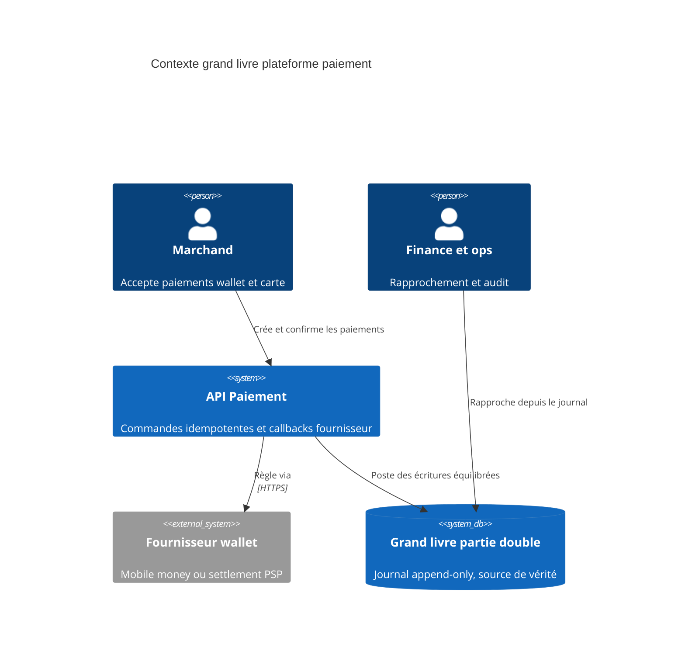

Les soldes mutables sont séduisants parce qu'ils sont simples à lire. Ils deviennent dangereux quand l'argent passe par des retries, annulations, callbacks fournisseur et settlements différés. Dès que la finance demande pourquoi un solde a changé, une table de valeur courante ne suffit plus.

## Contexte système

<Adr
  status="Accepté · 2025-04-12"
  context="La plateforme de paiement doit supporter intégrations wallet, callbacks fournisseur, remboursements, settlement partenaire et rapprochement finance. Les auditeurs ont besoin d'une trace immuable pour chaque mouvement posté."
  decision="Utiliser un grand livre en partie double avec écritures append-only. Chaque mouvement crée des écritures débit et crédit équilibrées dans une transaction ; les soldes dérivés peuvent être cachés, mais le journal reste la source de vérité."
  consequences="Positif : rapprochement et audit deviennent explicables depuis les données. Négatif : les ingénieurs doivent modéliser les événements comptables explicitement, et les écritures exigent une discipline transactionnelle plus forte."
/>

<Drawio
  src="/diagrams/double-entry-ledger-context.drawio"
  title="Journal vs projections"
  caption="Le journal du grand livre est la source de vérité. Les vues de soldes et caches sont des modèles de lecture dérivés, jamais l'autorité pour l'argent posté."
/>

<Callout variant="warning">
  Un grand livre n'est pas une fonctionnalité de reporting. C'est le contrat qui
  permet au produit, à la finance, au support et à la conformité de s'accorder
  sur ce qui est arrivé à l'argent.
</Callout>
