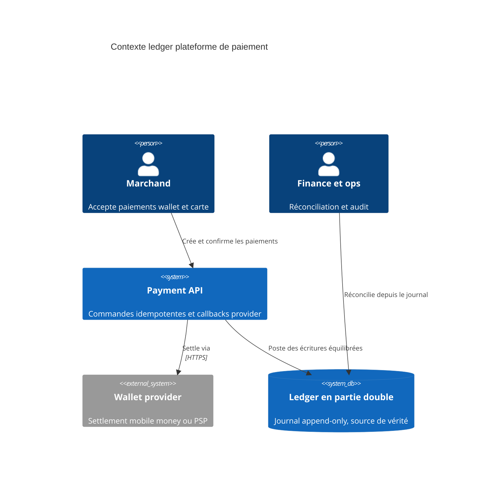

Les soldes mutables sont attractifs parce qu'ils sont simples à interroger. Ils sont aussi dangereux quand l'argent passe par retries, reversals, callbacks provider et settlement différé.

Le moment où la finance demande pourquoi un solde a changé, une seule table de valeur courante ne suffit plus.

## Contexte système

```mermaid
C4Context
  title Contexte ledger plateforme de paiement
  Person(merchant, "Marchand", "Accepte paiements wallet et carte")
  Person(ops, "Finance et ops", "Réconciliation et audit")
  System(payment_api, "Payment API", "Commandes idempotentes et callbacks provider")
  System_Ext(wallet, "Wallet provider", "Settlement mobile money ou PSP")
  SystemDb(ledger, "Ledger en partie double", "Journal append-only, source de vérité")
  Rel(merchant, payment_api, "Crée et confirme les paiements")
  Rel(payment_api, wallet, "Settle via", "HTTPS")
  Rel(payment_api, ledger, "Poste des écritures équilibrées")
  Rel(ops, ledger, "Réconcilie depuis le journal")
```

## Décision

<Adr
  status="Accepted · 2025-04-12"
  context="La plateforme de paiement doit supporter integrations wallet, callbacks provider, remboursements, settlement partenaires et réconciliation finance. Les auditeurs ont besoin d'une piste immuable pour chaque mouvement posté."
  decision="Utiliser un ledger en partie double avec postings append-only. Chaque mouvement crée des écritures débit et crédit équilibrées dans une transaction ; les soldes dérivés peuvent être mis en cache, mais le journal reste la source de vérité."
  consequences="Positif : réconciliation et audit deviennent explicables depuis les données. Négatif : les ingénieurs doivent modéliser les événements comptables explicitement, et les chemins d'écriture demandent une discipline transactionnelle plus forte."
/>

<Drawio
  src="/diagrams/double-entry-ledger-context.drawio"
  title="Journal vs projections"
  caption="Le journal du ledger est la source de vérité. Les vues de solde et caches sont des read models dérivés, jamais l'autorité pour l'argent posté."
/>

## Pourquoi pas une colonne balance ?

| Approche | Paraît bien pour | Casse quand |
| --- | --- | --- |
| `balance` mutable | Dashboards de démo | Retries, remboursements partiels, litiges |
| Event log sans partie double | Analytics | Débits sans crédits correspondants |
| Journal partie double + projections | Audit + scale | Exige une littératie comptable dès le départ |

Avec la partie double :

- chaque mouvement est **équilibré** (débits = crédits)
- l'historique est **append-only**
- les soldes sont **dérivés**, jamais autoritaires seuls
- « pourquoi ça a changé ? » est une requête journal, pas de l'archéologie

<Callout variant="warning">
  Un ledger n'est pas une feature de reporting. C'est le contrat qui permet à
  produit, finance, support et conformité de s'accorder sur ce qui est arrivé
  à l'argent.
</Callout>

## Revisiter quand

Rouvrir cet ADR si :

- vous introduisez des positions multi-devises qui demandent des événements FX explicites
- les régulateurs exigent un autre format d'export d'audit
- la latence d'écriture du journal devient une contrainte produit mesurable (alors optimiser les projections — ne pas abandonner le journal)

## En résumé

Correction d'abord. Vitesse du « UPDATE balance » ensuite. Le bug cher est celui que la finance ne peut pas expliquer.

> **Les caches montrent l'argent. Le journal prouve l'argent.**
