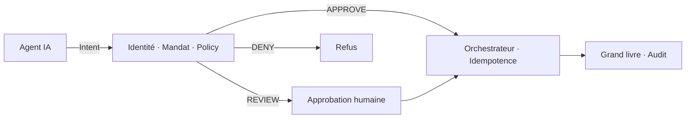

Le 24 juillet 2026, Visa et Lianlian DigiTech ont [annoncé un achat B2B réalisé par LoopXPay](https://www.prnewswire.com/apac/news-releases/visa-and-lianlian-advance-trusted-b2b-agentic-commerce-through-loopxpays-first-live-b2b-agentic-transaction-302833916.html) : sourcer, commander, payer — dans un même workflow, sous contrôles de dépense prédéfinis.

Le récit produit parle d'autonomie. Le récit architecture parle d'autorité.

Appeler une API de paiement est simple. Construire un système où l'agent peut être **identifié, mandaté, limité, révoqué et audité** : c'est le vrai chantier.

## Le changement qui compte

```text
AI recommends → Human decides → System executes
AI proposes    → System authorizes → System executes
```

La seconde voie semble être un progrès. Sans frontière de confiance, ce n'est qu'un modèle probabiliste avec accès à de l'argent.

Une stack paiement doit désormais répondre à plus que « qui est l'utilisateur ? » :

- quel **agent** agit ?
- pour quel **principal** ?
- sous quel **mandat** ?
- dans quelles **limites** ?
- avec quelle **preuve** ?

<Callout variant="warning">
  Un score de confiance du modèle n'est pas une autorisation. Une réponse
  convaincante n'est ni un mandat, ni une preuve que les fonds doivent bouger.
</Callout>

## Intent in, money out

L'agent ne doit jamais appeler le rail directement. Il émet une **intention de paiement** structurée. Une infrastructure déterministe décide si cette intention est autorisée.



Contrat central :

> **L'agent propose. Le système autorise. Ensuite seulement, l'argent bouge.**

## Ce que la trust layer doit porter

| Enjeu | Règle de design |
| --- | --- |
| **Identité** | Agent ≠ principal. Credentials courts, révocation immédiate. |
| **Mandat** | Spécifique, limité, temporel, non transférable, versionné. |
| **Policy** | Règles déterministes avec reason codes — indépendantes du LLM. |
| **Autonomie** | Auto / revue / blocage selon le risque — l'humain valide les exceptions, pas chaque paiement. |
| **Idempotence** | Dix retries = une intention économique. Réponse PSP ambiguë → contrôle de statut, jamais un nouveau débit. |
| **Audit** | Decision lineage : principal → agent → mandat → policy → paiement → grand livre. |

Donner à un agent les credentials bancaires du CFO n'est pas une délégation. C'est supprimer la frontière dont vous aurez besoin au litige, à l'audit et à l'incident.

## Là où ça se durcit en Afrique

Les stacks multi-rails — banques, mobile money, wallets, paiements instantanés — rendent le procurement agentique puissant. Elles multiplient aussi les modes de panne : changement de rail, callbacks incomplets, statuts non interchangeables (`SUCCESS` ≠ `SETTLED`).

Le problème difficile n'est pas de savoir si un LLM peut orchestrer les étapes. C'est de savoir si l'infrastructure absorbe retries, timeouts et erreurs de jugement **sans transformer l'autonomie en risque financier**.

## En clair

La prochaine couche concurrentielle des paiements n'est pas un modèle plus intelligent. C'est une **trust layer** entre l'intelligence qui veut agir et les rails qui déplacent le cash.

> **L'IA peut décider qu'un paiement est nécessaire. Elle ne devrait jamais décider seule qu'elle est autorisée.**

Confieriez-vous un budget à un agent aujourd'hui — et jusqu'où irait son mandat ?
