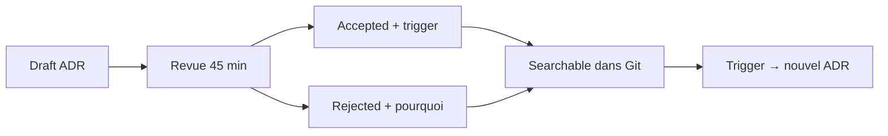

Les revues déraillent quand la salle optimise pour **paraître** intelligente plutôt que pour **réduire** le risque. Le livrable est une invitation calendrier et un malaise vague — pas une décision qui survit à la prochaine vague d'embauches.

Une revue utile est courte, adversariale au bon sens, et se termine avec des owners et des dates.

## Ce qu'une mauvaise revue produit

- Des diagrammes que personne ne possède
- « On devrait regarder X » sans owner
- Un consensus qui s'évapore au premier incident
- Aucune trace qu'un nouveau collaborateur peut lire en vingt minutes

Si la réunion ne laisse pas derrière elle une décision searchable, c'était du théâtre.

## Le contrat : ADR d'une page

<Adr
  status="Accepted · 2024-12-05"
  context="Les squads passaient des demi-journées en forums d'architecture sans décision enregistrée. Le produit avait besoin d'aligner plus vite latence / coût / conformité sans escalader chaque choix à un comité."
  decision="Adopter un ADR d'une page par décision matérielle : contexte (avec liens), décision, conséquences (positives et négatives), et un trigger de revisit explicite (seuil métrique, date, ou événement réglementaire). Les revues de plus de 45 minutes sont découpées ou annulées."
  consequences="Positif : décisions searchable dans Git ; les nouveaux lisent l'historique plutôt que le lore. Négatif : discipline requise pour mettre à jour le statut quand les hypothèses changent ; accepted n'est pas éternel sans trigger."
/>

## Comment tenir la salle

| Rôle | Mission |
| --- | --- |
| **Auteur** | Livre le draft ADR 24h avant ; possède la décision |
| **Sceptique** | Attaque les hypothèses, pas les personnes |
| **Facilitateur** | Timeboxe ; tue le sprawl de slides |
| **Scribe** | Met à jour statut et follow-ups dans la même PR |

Règles qui gardent les revues utiles :

1. **Agenda publié** — trois questions max : quoi, pourquoi, quand rouvrir.
2. **45 minutes ou moins** — découper ou annuler ; ne pas étirer pour la politique.
3. **Follow-ups dans le prochain sprint** — les parking lots qui n'atterrissent jamais sont de la dette souriante.
4. **Triggers de revisit obligatoires** — « accepted » sans condition de sortie est un dogme.

<Callout variant="info">
  Un bon ADR répond à trois questions : qu'avons-nous décidé, pourquoi, et
  qu'est-ce qui nous ferait rouvrir la discussion ? Si une réponse manque, la
  revue n'est pas terminée.
</Callout>

## En résumé

Ce format scale du seed aux orgs multi-lignes parce qu'il optimise pour la **clarté et la mémoire**, pas le nombre de slides.

> **Une revue d'architecture qui ne laisse pas une décision dans Git n'a pas eu lieu.**
