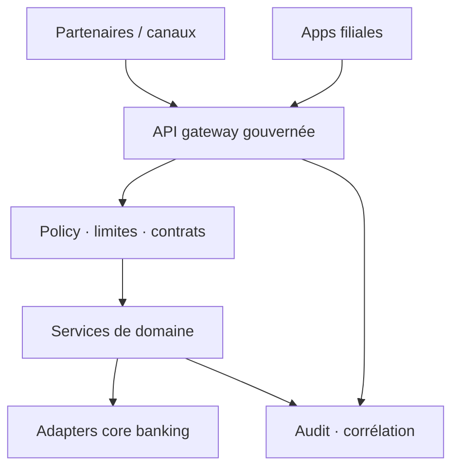

Une banque multi-filiales n'a pas besoin d'une autre couche API fine. Elle a besoin d'une **frontière contrôlée** entre des cores fragiles, des équipes produit rapides, et des partenaires externes.

Le middleware doit normaliser identité, contrats, rate limits, pistes d'audit et visibilité ops — sans devenir la décharge de chaque exception.

## Partir de la gouvernance, pas des endpoints

La première décision de design est l'ownership :

- qui peut **publier** une API ?
- qui approuve un changement **breaking** ?
- où vit l'**OpenAPI canonique** ?

Une fois c'est explicite, la gateway peut imposer versioning, authentification, validation d'entrée et corrélation **avant** que le trafic n'atteigne les services de domaine ou l'adapter core banking.

<Callout variant="info">
  Un middleware bancaire réussit quand les incidents deviennent traçables :
  requête partenaire → décision gateway → événement domaine → réponse core →
  audit partagent une même histoire de corrélation.
</Callout>

## Concevoir pour la variance filiale

Les filiales partagent rarement les mêmes règles : limites, contrôles de conformité, SLA partenaires, fenêtres de settlement. Gardez ces différences dans la **policy et la configuration**, pas dans des services forqués.

| Cœur plateforme partagé | Policy locale / filiale |
| --- | --- |
| Patterns AuthN / AuthZ | Matrices de limites, profondeur KYC |
| Schéma corrélation + audit | Calendriers de settlement |
| Versioning de contrats | Allowlists partenaires |
| Standards d'observabilité | SLA d'escalade |

L'architecture doit rendre les règles locales explicites tout en préservant une colonne vertébrale unique.

<Drawio
  src="/diagrams/banking-middleware-platform.drawio"
  title="Frontière plateforme"
  caption="Partenaires et filiales partagent une gateway gouvernée, une couche policy et une piste d'audit avant les services de domaine ou les adapters core banking."
/>

## Ce que le middleware doit posséder

1. **Frontière d'identité** — credentials partenaires ≠ credentials core ; tokens courts ; révocation réelle.
2. **Frontière de contrat** — OpenAPI versionné ; pas de dérive silencieuse de sémantique.
3. **Observabilité de l'argent** — chaque tentative de débit a un correlation id que finance et ops peuvent suivre.
4. **Policy d'échec** — timeouts, retries et circuit breakers définis une fois, pas par squad.

Donner aux équipes produit les credentials bruts du core n'est pas de la vélocité. Ça efface la frontière dont vous aurez besoin dans la revue d'incident et chez le régulateur.

## En résumé

Un middleware qui se contente d'« exposer des APIs » devient un passif. Un middleware qui **gouverne le trafic qui touche l'argent** devient le système d'exploitation du changement bancaire.

> **Protéger le core. Configurer la variance. Tracer chaque requête qui peut déplacer de l'argent.**
