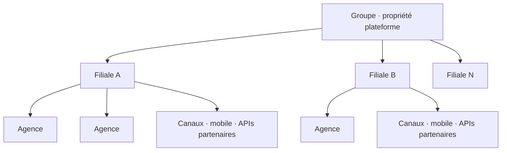

Un groupe bancaire veut une seule plateforme pour les dépôts, les paiements et les opérations d’agence — pas onze cores distincts à maintenir en vie. Chaque filiale reste une entité légale avec sa devise, son catalogue produits et son régulateur. Chaque agence est un point d’opération — caisse, plafonds, équipes — pas une banque à part.

Le Banking-as-a-Service centralisé ne tient que si cette hiérarchie est modélisée volontairement : **un contrat de plateforme commun**, plusieurs réalités de filiale, des milliers de contextes d’agence qui ne doivent jamais fuiter les uns dans les autres.

## Ce que « centraliser » veut vraiment dire

Centralisez la **plateforme** : APIs, moteurs de ledger, identité, orchestration, observabilité, trains de release.

Ne centralisez **pas** le risque, la conformité ni les soldes dans un blob indifférencié. Un code partagé avec des frontières d’entité de premier ordre n’est pas une base partagée où l’argent de chaque filiale se cache derrière le même `WHERE`.

| Centraliser | Garder local |
| --- | --- |
| Contrats API & trains de release | Plan comptable, devise |
| Moteur de ledger (code) | Données de ledger (par entité) |
| Patterns d’identité & schéma d’audit | Plafonds agence, hiérarchie de coffre |
| Standards d’observabilité | Calendriers de reporting réglementaire |

Le groupe gagne en vitesse et en cohérence ; chaque filiale garde son périmètre légal et opérationnel.

## La hiérarchie à modéliser

- **Groupe** — propriété de la plateforme, standards, reporting transversal, contrats partenaires à l’échelle
- **Filiale** — entité légale : plan comptable, devise, produits locaux, reporting réglementaire, calendriers de settlement
- **Agence** — point de service : caisse, rôles guichet, plafonds locaux, horaires, parc de terminaux
- **Canaux** — mobile, agency banking, APIs partenaires : mêmes commandes métier, enveloppes d’auth et de risque différentes

## Piliers d’architecture d’un BaaS multi-filiales

1. **Tenancy d’abord** — chaque commande, événement et ligne porte un `entityId` explicite ; l’isolation est une fonction produit, pas un filtre après coup.
2. **Ledger par filiale** — soldes et écritures en partie double ne traversent jamais les entités légales ; les vues groupe sont des agrégations, pas un méga-ledger.
3. **Catalogue produits paramétrique** — primitives partagées (compte, transfert, frais) avec règles, plafonds et tarifs locaux plutôt que des services forkés.
4. **Identité et périmètre agence** — un caissier voit une agence ; un ops filiale voit une entité ; les rôles groupe sont rares et audités.
5. **Double reporting** — clôture réglementaire et financière par filiale, plus consolidations groupe qui n’affaiblissent jamais les contrôles d’entité.

<Callout variant="warning">
  Le mode de panne coûteux, c’est la « base partagée sans frontières », ou onze
  forks du même core « juste pour ce marché ». Les deux semblent plus rapides
  le premier mois. Les deux deviennent impossibles à releaser dès la deuxième
  année — surtout dans les groupes multi-pays d’Afrique de l’Ouest où chaque
  filiale vit déjà une réalité opérationnelle différente.
</Callout>

## Les agences dans une solution centralisée

Les agences sont de la **configuration et de l’autorisation**, pas des déploiements séparés. Plafonds de caisse, hiérarchies de coffre, workflows guichet, heures de cut-off et inventaire des terminaux appartiennent à des couches de politiques scopées par filiale.

La plateforme livre un seul train de release ; chaque agence hérite des règles de sa filiale et y ajoute des contraintes locales. Quand un caissier enregistre un dépôt, la commande est la même partout — **entité, agence et canal** voyagent avec elle pour que l’audit, le rapprochement et le support ne devinent jamais le périmètre.

C’est la même posture que pour un [middleware bancaire multi-filiales](/fr/articles/banking-middleware-multi-subsidiary) : gouverner une fois, configurer la variance, ne jamais forker le socle.

## En résumé

Le BaaS multi-filiales n’est pas « le même core onze fois ». C’est un contrat de plateforme et N réalités opérationnelles.

> **Concevez pour la variance dès la deuxième filiale et la première agence — ou vous le paierez plus tard en forks, incidents et trous réglementaires.**
