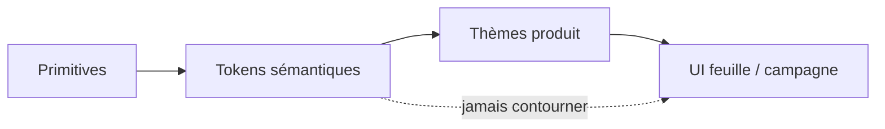

Quand chaque squad invente une nuance légèrement différente de « primary » pour une landing, vous n'avez pas un design system. Vous avez un zoo de couleurs.

La frontière n'est pas « design vs code ». C'est la **stabilité sémantique** vs l'**expression contextuelle**.

<DesignNote>
  **Principe :** garder les tokens **sémantiques** (ex. `--surface-elevated`,
  `--text-muted`, `--focus-ring`) possédés par le design system. Laisser les
  couches **produit** composer ces tokens en gradients, skins de campagne ou
  accents saisonniers seulement aux composants **feuille** — jamais en forquant
  les primitives bouton ou input.
</DesignNote>

## Deux couches, un contrat

| Couche | Exemples | Owner | Peut changer pour une campagne ? |
| --- | --- | --- | --- |
| **Sémantique** | `--text-primary`, `--danger`, `--focus-ring` | Design system | Non |
| **Produit / feuille** | Gradient hero, fill badge saisonnier | Design produit | Oui |

Les skins produit doivent composer le sémantique. Elles ne doivent pas redéfinir le contrat de contraste de la primitive bouton.

## Checklist de handoff

- Nommer les tokens par **rôle** (ce qu'ils font), pas par hex ou nom de layer Figma.
- Documenter les paires dark-mode à côté du light dans la **même** table — la dérive se cache dans des tables séparées.
- Shipper un export JSON (ou variables CSS) qui matche **octet pour octet** ce que l'app consomme.
- Définir focus, contraste et motion au niveau système — les skins ne doivent pas affaiblir les chemins WCAG critiques.
- Versionner le package de tokens ; un rename breaking a besoin d'une note de migration, pas d'une surprise Slack.

<Callout variant="warning">
  Si un « brand refresh » exige de toucher cinquante primitives, vos tokens
  n'étaient pas sémantiques — c'étaient des alias vers une seule palette.
</Callout>

## Le troisième thème que personne n'a nommé

Quand Figma et la prod divergent, le bug est souvent un **troisième thème implicite** — dark mode, high-contrast, ou « marketing only » — que personne n'a mis dans le contrat design / engineering.

Nommez-le. Versionnez-le. Testez-le avec les mêmes règles de contraste que le thème par défaut.

## En résumé

Les tokens sont de la gouvernance pour le langage visuel. Sans frontière, chaque lancement invente un nouveau système.

> **Les tokens sémantiques sont de l'infrastructure. La couleur de campagne est de la décoration. Ne laissez jamais la décoration réécrire l'infrastructure.**
