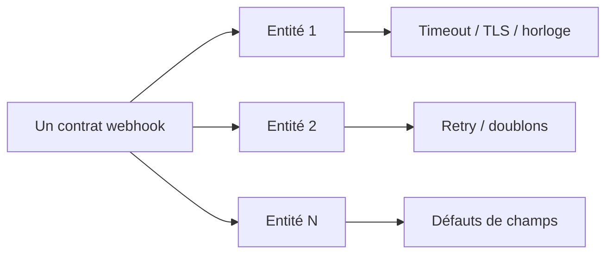

Une filiale, un endpoint webhook, un chemin nominal — ça marche du premier coup, et on est tenté de livrer le même contrat partout.

Multipliez cet endpoint par onze entités bancaires avec chacune sa propre infrastructure, sa propre politique de sécurité et sa propre idée de ce qu'est « à temps », et le contrat qui semblait béton en staging se met à fuir de façons qu'aucun test mono-tenant ne détecterait.

## Les modes de panne qui n'apparaissent qu'à N entités

| Mode de panne | Pourquoi le staging l’a raté |
| --- | --- |
| Budgets de timeout différents par pare-feu filiale | Un seul chemin réseau en staging |
| Rotation TLS / certificats non synchronisée | « Cassé cette nuit » ≠ la même nuit |
| Décalage d’horloge et fenêtres de signature | Horloges lab propres (NTP) |
| Livraison en double sous retries agressifs | Charge + politique de queue par entité |
| Champ « optionnel » interprété différemment | Une équipe a comblé un vide de spec |

<Callout variant="warning">
  Aucun de ces cas n'est un bug exotique. Chacun est banal pris isolément —
  et invisible jusqu'à ce que la filiale numéro sept ou huit le révèle en
  production, en général pendant une fenêtre de règlement.
</Callout>

## Concevoir pour la variance, pas pour une filiale témoin

La solution n'est pas une librairie de retry plus maligne. C'est de traiter la **configuration par filiale** comme un pilier de l'architecture dès la deuxième entité :

1. **Budgets de timeout explicites** par filiale — mesurés, pas copiés de la filiale témoin.
2. **Clés d'idempotence** conçues pour survivre à une livraison en double — pas régénérées à chaque tentative.
3. **Vérification de signature** avec une fenêtre d'horloge tolérante — et monitoring du skew qui la dépasse.
4. **Correlation IDs** qui relient un webhook à l'entité, au numéro de tentative et à la version exacte du contrat.

Cela complète la discipline des callbacks dans les [patterns d'intégration mobile money](/fr/articles/mobile-money-integration-patterns) : vérifier, puis transitionner ; ne jamais supposer un seul chemin nominal.

## Ce qu’il faut instrumenter dès le jour un

- Taux de succès / latence / doublons **par entité** sur la même version de contrat
- Alerte quand le p99 d’une filiale diverge fortement de la médiane groupe
- Version de contrat stampée sur chaque signature sortante et chaque ligne d’audit entrante

Sans cela, « le webhook est capricieux » reste du folklore au lieu d’un signal ops.

## En résumé

Le travail d'intégration multi-filiales n'est pas « le même webhook onze fois ».

> **Un contrat. Onze réalités opérationnelles. Zéro fork du code — la variance vit dans la configuration.**
