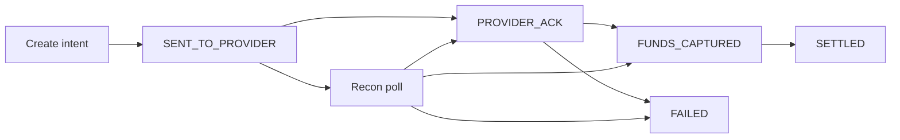

Les rails mobile money en Afrique de l'Ouest ne sont pas uniformes. Wave, Orange Money et Free Money exposent chacun des sémantiques de callback, des fenêtres de settlement et des comportements de retry différents.

Un paiement marqué `SUCCESS` par le provider n'est pas toujours une transaction settled. Construire comme si c'était le cas devient un cauchemar de réconciliation six mois après la prod. Le vocabulaire plus précis est dans [quand SUCCESS n'est pas settled](/articles/when-success-is-not-settled) — cet article est le pattern d'intégration qui évite le piège.

## Découpler initiation et confirmation

La plupart des providers livrent un webhook de façon asynchrone — parfois en secondes, parfois en minutes, parfois jamais si votre endpoint était down.

Votre architecture doit :

1. Stocker l'**intent** immédiatement à l'initiation.
2. Mettre à jour l'état seulement après un callback **vérifié** (ou un status poll).
3. Lancer la réconciliation pour les intents encore pending au-delà du SLA provider.

## Mapper les codes provider — ne pas les mirroir

Ne mettez jamais `settledAt` sur le premier callback `SUCCESS`. Mappez le vocabulaire provider vers une machine d'états interne que finance, support et produit peuvent partager.

<CodeBlock title="Handler de callback — vérifier, mapper, transitionner">{`public enum InternalPaymentState {
  INITIATED, SENT, PROVIDER_ACK, FUNDS_CAPTURED,
  SETTLED, FAILED, EXPIRED
}

@Transactional
public PaymentIntent handleCallback(CallbackPayload payload) {
  verifyHmac(payload); // rejeter les SUCCESS spoofés

  PaymentIntent intent = repository
    .findByProviderRef(payload.getReference())
    .orElseThrow(() -> new UnknownReferenceException(payload.getReference()));

  if (intent.isTerminal()) {
    return intent; // no-op idempotent
  }

  ProviderStatus mapped = adapter.mapStatus(payload.getCode());
  switch (mapped) {
    case ACCEPTED -> intent.transition(PROVIDER_ACK);
    case DEBITED -> intent.transition(FUNDS_CAPTURED);
    case SETTLED -> intent.transition(SETTLED);
    case FAILED -> intent.transition(FAILED);
    default -> auditLog.unknown(payload);
  }

  auditLog.record(intent, payload.getRawBody());
  return repository.save(intent);
}`}</CodeBlock>

<Callout variant="warning">
  Vérifiez toujours la signature du callback contre la clé HMAC du provider
  avant de mettre à jour l'état. Des callbacks spoofés qui marquent SUCCESS
  sans settlement sont un vrai vecteur d'attaque.
</Callout>

## La réconciliation comme job de premier rang

| Cadence | Périmètre | Action |
| --- | --- | --- |
| Toutes les 5 min | Intents actifs au-delà du SLA | Poller l'API status provider |
| Horaire / quotidien | Batch de la veille | Matcher les lignes du fichier de settlement |
| File manuelle | `UNKNOWN` après N polls | Jamais d'auto-success |

Traitez la divergence comme une **alerte**, pas comme une surprise tableur.

## Variance provider à concevoir

| Préoccupation | Ce qui varie | Règle de design |
| --- | --- | --- |
| Timing callback | Secondes → jamais | Intent d'abord ; recon ferme les trous |
| Noms de statut | `SUCCESS` ≠ settled | Enum interne + table d'adapter |
| Settlement | Float instantané vs CSV T+1 | Séparer `FUNDS_CAPTURED` / `SETTLED` |
| Retries | Client + provider | Clé d'idempotence à l'initiation |

## En résumé

Les systèmes qui scalent à des millions de transactions sans casser la finance ne sont pas ceux aux SDK provider les plus rapides. Ce sont ceux où chaque état d'argent est **explicite, observable et récupérable** sans héroïsme manuel.

> **Intégrez le rail. Possédez la machine d'états. Laissez la réconciliation — pas l'optimisme — fermer la boucle.**
