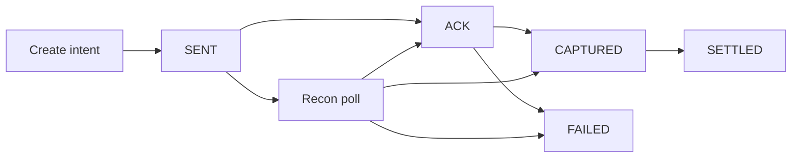

[Le callback qui a dit SUCCESS](/fr/articles/when-success-is-not-settled) est le vocabulaire. Ceci est la machine.

Un statut provider n'est pas un statut métier. C'est un événement à interpréter. Le handler qui copie `SUCCESS` dans `settledAt`, c'est le lundi matin.

Les rails mobile money en Afrique de l'Ouest ne sont pas uniformes. Ils ne partagent ni dictionnaire, ni fenêtre de settlement, ni comportement de retry. Votre domaine, si.

## Trois faits, pas trois traductions

Ce ne sont pas des libellés du même moment :

**ACK** — le rail a reçu ou accepté la demande.
**CAPTURED** — la valeur a effectivement bougé : débit ou crédit.
**SETTLED** — la finance reconnaît la ligne dans le règlement ou le rapprochement.
**FAILED** même si un callback antérieur annonçait un succès.

Exposez ACK ou CAPTURED à l'utilisateur. Écrivez au ledger à CAPTURED ou à SETTLED — **une seule politique, formellement documentée**. Mélangez les deux, et le fichier de settlement ne collera pas à l'application.

Ne posez jamais `settledAt` sur le premier callback.

## Découpler initiation et confirmation

La plupart des providers livrent un webhook de façon asynchrone — secondes, minutes, parfois jamais si votre endpoint était down. Les webhooks arrivent aussi en double, en retard, ou dans le désordre. C'est normal. Traiter le premier paquet comme une vérité, non.

Votre architecture doit :

1. Stocker l'**intent** immédiatement à l'initiation.
2. Mettre à jour l'état seulement après un callback **vérifié** — ou un status poll.
3. Lancer la réconciliation pour les intents encore pending au-delà du SLA provider.

## Mapper l'événement — ne pas recopier le mot

Chaque rail a un adapter. L'adapter possède le contrat de ce rail. Le handler ne lit jamais `SUCCESS`.

<CodeBlock title="Handler de callback — vérifier, interpréter, transitionner">{`public enum InternalPaymentState {
  INITIATED, SENT, ACK, CAPTURED, SETTLED, FAILED, EXPIRED
}

@Transactional
public PaymentIntent handleCallback(CallbackPayload payload) {
verifyHmac(payload);

PaymentIntent intent = repository
.findByProviderRef(payload.getReference())
.orElseThrow(() -> new UnknownReferenceException(payload.getReference()));

if (!intent.canAdvance()) {
auditLog.duplicateOrStale(intent, payload);
return intent; // persister le body brut ; ne jamais reculer
}

Fact fact = adapterFor(payload.getRail()).interpret(payload);
switch (fact) {
case ACK -> intent.transition(ACK);
case CAPTURED -> intent.transition(CAPTURED);
case SETTLED -> intent.transition(SETTLED);
case FAILED -> intent.transition(FAILED);
case UNKNOWN -> auditLog.unknown(payload); // recon pollera
}

auditLog.record(intent, payload.getRawBody());
return repository.save(intent);
}`}</CodeBlock>

`interpret()` est le dictionnaire. Chez un rail, `SUCCESS` est un ACK. Chez un autre, un CAPTURED. Chez un troisième, un état intermédiaire. Le mot n'est pas le moment — l'adapter l'est.

Les transitions sont **monotones**. ACK peut devenir CAPTURED ou FAILED. CAPTURED ne redevient pas ACK parce qu'un webhook tardif est arrivé dans le désordre.

<Callout variant="warning">
  Vérifiez la signature du callback contre la clé HMAC du provider avant toute
  transition. Un SUCCESS spoofé que votre handler copie dans le ledger n'est pas
  un bug de mapping. C'est une attaque.
</Callout>

## La réconciliation comme job de premier rang

Le `FAILED` manqué, le webhook qui n'est jamais arrivé, l'API de statut qui dit encore succès alors que le règlement est en attente — rien de tout cela n'est un incident si la recon est un job.

| Cadence             | Périmètre                     | Action                                      |
| ------------------- | ----------------------------- | ------------------------------------------- |
| Toutes les 5 min    | Intents actifs au-delà du SLA | Poller l'API de statut                      |
| Horaire / quotidien | Batch de la veille            | Matcher les lignes du fichier de settlement |
| File manuelle       | `UNKNOWN` après N polls       | Jamais d'auto-success                       |

Traitez la divergence comme une **alerte**, pas comme une surprise tableur. Le rapprochement comble un écart. Il ne crée pas de francs.

## Ce qui doit varier — sans copier une spec

| Préoccupation   | Ce qui varie                    | Règle de design                        |
| --------------- | ------------------------------- | -------------------------------------- |
| Timing callback | Secondes → jamais               | Intent d'abord ; recon ferme les trous |
| Noms de statut  | Même mot, fait différent        | Adapter par rail ; enum interne        |
| Livraison       | Doublon, manqué, désordre       | Handler idempotent ; états monotones   |
| Settlement      | Float instantané vs fichier T+1 | Séparer CAPTURED et SETTLED            |
| Retries         | Client + provider               | Clé d'idempotence à l'initiation       |

Les retries sont le prochain mode de panne. Un timeout n'autorise pas un second débit — ce pattern est dans [la tempête de retries qui a failli payer un marchand deux fois](/fr/articles/retry-storm-double-payout).

## En résumé

Les systèmes qui tiennent en production ne sont pas ceux au SDK provider le plus rapide. Ce sont ceux où chaque état d'argent est **explicite, observable et récupérable** sans héros du lundi.

> **Un callback est une phrase dans la langue du provider. Ce handler est le traducteur. La réconciliation — pas le premier SUCCESS — ferme la boucle.**
