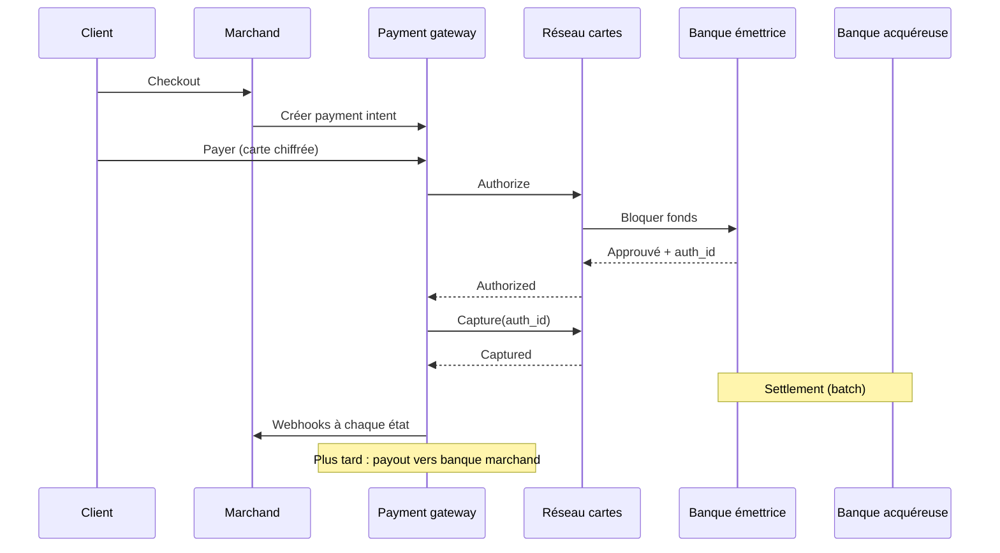
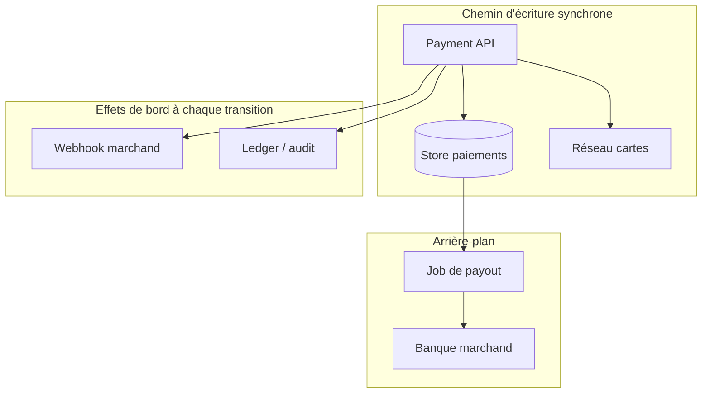
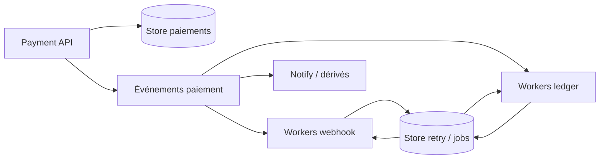

Une payment gateway n'est pas une banque. C'est l'intermédiaire licencié qui déplace l'argent de la carte d'un client vers le compte d'un marchand — via les réseaux de cartes, la banque acquéreuse, un ledger interne, des webhooks et des payouts différés.

Les schémas d'entretien s'arrêtent souvent à « appeler Visa ». Les systèmes de production cassent dans les interstices : l'API meurt avant l'écriture au ledger, le webhook marchand est down une journée, ou deux retries atteignent tous les deux le réseau. Cet article parcourt le cycle de vie complet — le domaine d'abord, puis un design qui tient pour quelques marchands, puis les briques qui survivent à une charge type Stripe.

Le vocabulaire et les modes de panne collent aux mêmes frontières que pour le mobile money dans [concevoir des systèmes fintech scalables](/fr/articles/scalable-fintech-systems) et [le callback qui a dit SUCCESS](/fr/articles/when-success-is-not-settled).

## Domaine : qui déplace l'argent

| Rôle                   | Qui                  | Mission                                          |
| ---------------------- | -------------------- | ------------------------------------------------ |
| **Client du marchand** | Porteur de carte     | Paie biens / services                            |
| **Marchand**           | Votre client         | Vend ; reçoit les payouts                        |
| **Payment gateway**    | Vous (type Stripe)   | Intent, auth, capture, ledger, webhooks, payouts |
| **Banque émettrice**   | Banque du client     | A émis la carte                                  |
| **Réseau de cartes**   | Visa, Mastercard, …  | Route auth/capture entre banques                 |
| **Banque acquéreuse**  | Banque de la gateway | Reçoit les fonds du réseau                       |
| **Ledger**             | Votre comptabilité   | Débit/crédit équilibrés pour chaque mouvement    |

Pourquoi les marchands passent par une gateway plutôt que d'intégrer les réseaux eux-mêmes : licences, périmètre PCI, certification, et amendes si vous vous trompez. Le produit n'est pas « une API » — c'est un **mouvement d'argent régulé avec une piste d'audit**.

### Auth → capture → settlement

L'argent carte ne bouge pas en un seul hop. Trois étapes comptent :

1. **Authorization** — bloquer les fonds sur le compte client ; contrôles fraude ; parfois 3-D Secure (même forme qu'OAuth).
2. **Capture** — confirmer l'auth ; le réseau s'engage à déplacer l'argent. Idempotent côté réseau pour un `auth_id` donné.
3. **Settlement** — les banques déplacent réellement les soldes (souvent en batch, heures à jours plus tard).

Modèle mental utile : auth ≈ begin transaction, capture ≈ commit, settlement ≈ réplication vers le nœud que la finance fait confiance.



### Le rapprochement n'est pas optionnel

Les banques comparent leurs ledgers entre elles parce qu'elles communiquent de façon asynchrone. Les gateways doivent faire de même — surtout pour les **payouts** : soldes du ledger interne versus ce qui est réellement arrivé sur les comptes marchands. Même discipline que le matching des fichiers de settlement mobile money ; rails différents.

## Exigences

### Fonctionnelles

- Le marchand peut s'enregistrer (profil, clés API, URL webhook + secret de signature)
- Les clients peuvent payer les biens/services du marchand
- Le marchand reçoit des webhooks sur les changements d'état
- Le marchand reçoit l'argent via **payout** sur son compte bancaire
- Pas de double débit pour le même payment intent
- Audit : chaque événement qui touche l'argent atterrit dans un **ledger** (exigence légale)

### Non-fonctionnelles (échelle type Stripe)

| Signal                   | Ordre de grandeur                                        |
| ------------------------ | -------------------------------------------------------- |
| Payment API              | ~10k rps en pic (centaines de millions de requêtes/jour) |
| Événements ledger / état | ~100k rps en pic                                         |
| Marchands                | des millions                                             |
| Pics                     | saisonniers (Black Friday) et marchands « célébrités »   |

Politique de cohérence qui gagne souvent l'entretien _et_ la réalité :

- **Cohérence forte (linéarisabilité)** sur le chemin chaud du paiement — pas de double débit
- **Cohérence éventuelle** pour les dashboards marchands et certaines projections ledger
- **Aucune perte de données** sur les écritures ledger
- Webhooks : **at-least-once**, avec retries mesurés en jours, pas en minutes
- Invariant ledger : débits et crédits somment à zéro

## Chemin heureux sur une seule machine

Avant de sharder Kafka, rendre l'histoire d'argent correcte sur un seul déploiement.



### 1. Enregistrement marchand

CRUD pour le profil, l'endpoint webhook et les secrets. Signer les webhooks sortants pour que le marchand vérifie l'authenticité. Émettre des clés API scopées à ce marchand.

### 2. Le client paie

1. Le marchand (ou Checkout) crée un **payment** en statut `new` — biens, montant, devise, id marchand.
2. Le client envoie les données carte chiffrées avec cet id.
3. L'API fait progresser le statut vers l'authorization, appelle le réseau **Authorize**.
4. Persister `auth_id`, statut `authorized`.
5. **Capture** (même requête, ou worker / capture déclenchée par le marchand).
6. Persister `captured`.
7. Plus tard, un worker de payout agrège les captures réussies et crédite la banque du marchand.

À chaque transition significative : émettre un webhook marchand et append une écriture ledger. Ce n'est pas du logging optionnel.

### 3. Pas de double débit — CAS sur le statut

Le double débit sous concurrence est l'échec classique : le client retry `POST /payments/:id/pay` pendant que le premier appel autorise encore.

Utiliser un compare-and-swap sur le statut pour qu'un seul gagnant parle au réseau :

```sql
UPDATE payments
SET status = 'authorizing'
WHERE id = $id AND status = 'new';
-- n'appeler Authorize que si rows_affected = 1

UPDATE payments
SET status = 'authorized', auth_id = $auth_id
WHERE id = $id AND status = 'authorizing';
```

La capture est idempotente côté réseau pour un `auth_id` donné, donc les retries sont sûrs une fois cet id acquis. Même idée que [la tempête de retries qui a failli payer un marchand deux fois](/fr/articles/retry-storm-double-payout) : la clé métier (ici id de paiement + machine à états) doit survivre aux timeouts.

<Callout variant="warning">
  Si deux threads voient tous les deux le statut <code>new</code> et appellent
  tous les deux Authorize, vous avez déjà perdu — sauf si le réseau déduplique
  lui-même. Possédez la transition dans votre store avant de quitter la
  frontière de votre processus.
</Callout>

### 4. Ledger à chaque événement

Chaque auth, capture, frais, remboursement et payout poste des écritures équilibrées. L'[ADR du ledger en partie double](/fr/articles/adr-double-entry-ledger-payments) est le contrat : le journal prouve l'argent ; les dashboards ne font que le projeter.

### Limites du design « une boîte »

Ça marche pour les démos et le faible trafic. Ça casse en ops réelle :

- Payout acquitté par la banque, worker mort avant persistance → vous ne savez pas s'il faut retry
- API marchand down 24h → un webhook « fire and forget » perd l'événement
- API morte après capture réseau, avant écriture ledger → trou légal / audit
- Marchands chauds et Black Friday → un primary Postgres ne tiendra pas 10k rps paiements + 100k événements ledger

## Scale : effets de bord hors du chemin de requête

Le succès d'un paiement a des effets de bord indépendants : webhooks, projections ledger, notifications, analytics. Ils échouent et retardent indépendamment. Les mettre derrière un **broker de messages** (Kafka ou équivalent) avec des workers dédiés par préoccupation.



### Correctness en at-least-once

Les workers meurent. Les endpoints marchands renvoient 500 pendant des jours. On ne peut pas perdre les lignes d'audit.

- Persister les tentatives de livraison (outbox webhook / store de retry) avec backoff jusqu'à **~30 jours** pour les webhooks marchands
- Les consumers ledger retry jusqu'au succès — « at least once » avec clés d'idempotence de posting (payment id + type d'événement + séquence)
- La livraison en double est acceptable ; l'effet **économique** en double ne l'est pas

### Sharding et stores dérivés

| Composant              | Approche de scale                                  | Notes                                                       |
| ---------------------- | -------------------------------------------------- | ----------------------------------------------------------- |
| **Payment API**        | Scale horizontal stateless, LB multi-région        | Facile                                                      |
| **Store paiements**    | Shard par **payment id**                           | Évite les hotspots marchand célébrité sur l'écriture        |
| **Store marchand**     | Shard par **merchant id**                          | Chemin dashboard/requête ; sync depuis les événements       |
| **Audit / ledger**     | Shard par payment id (ou stratégie journal dédiée) | Ne doit pas perdre de données ; patterns de query variables |
| **File d'événements**  | Partition par payment id                           | Ordre par paiement                                          |
| **Workers**            | Scale avec les partitions                          | Stateless                                                   |
| **Store retry / jobs** | Shard par job id ; index par type                  | Payouts et retries webhook                                  |

Sharder les paiements par payment id transforme les dashboards marchands en cauchemar scatter/gather. Corriger avec des **données dérivées** : streamer les updates vers un read model shardé par merchant id. Les marchands célébrités s'isolent (shards dédiés / rate limits).

### Choix CAP alignés sur l'argent

| Store                 | Cohérence                 | Biais de réplication           | Pourquoi                                                                   |
| --------------------- | ------------------------- | ------------------------------ | -------------------------------------------------------------------------- |
| **Store paiements**   | Linéarisable              | Consensus (famille Raft/Paxos) | Décisions du chemin chaud ; pas de lectures périmées « encore `new` »      |
| **Store marchand**    | Éventuelle                | Leader–follower async OK       | Un lag dashboard de quelques minutes est tolérable produit                 |
| **Audit / ledger**    | Durable, éventuelle       | Leaderless / multi-leader      | Ne pas perdre d'écritures ; peu de concurrence par ligne                   |
| **File d'événements** | Quorum / log répliqué     | ISR type Kafka                 | Pas de drop silencieux d'événements paiement                               |
| **Store retry**       | Durable, pas linéarisable | Leaderless / multi-leader      | Jobs at-least-once ; lignes perdues = argent perdu ou marchands silencieux |

<Callout variant="info">
  Les données du dashboard marchand ne sont pas la source de vérité de l'argent.
  Quand produit et finance divergent, le ledger et le store de paiement gagnent
  — pas la projection éventuellement cohérente.
</Callout>

## Correspondance avec les rails ouest-africains

Les réseaux de cartes sont un rail. Wave, Orange Money et Free Money en sont un autre. La **forme** d'une bonne gateway ne change pas :

| Concept gateway carte           | Analogue mobile money                                                                          |
| ------------------------------- | ---------------------------------------------------------------------------------------------- |
| Payment intent + CAS de statut  | Commande de débit idempotente                                                                  |
| Auth / capture / settlement     | Accepté → fonds capturés → settled ([états séparés](/fr/articles/when-success-is-not-settled)) |
| Webhook + retry 30 jours        | Callbacks provider + vos webhooks partenaires sortants                                         |
| Payout + rapprochement bancaire | Fichiers de settlement marchand + rapprochement du float                                       |
| Écritures ledger équilibrées    | Pareil — voir l'[ADR ledger](/fr/articles/adr-double-entry-ledger-payments)                    |

Onze filiales avec onze bizarreries de webhook sont un problème d'exploitation **par-dessus** ce contrat — pas une raison de s'en passer. Voir [onze filiales, onze façons de casser un webhook](/fr/articles/eleven-subsidiaries-eleven-ways-to-break-a-webhook).

## Ce qu'il faut défendre en design review

1. **Posséder la machine à états** avant d'appeler les APIs d'argent externes.
2. **Les effets de bord sont asynchrones** et retryés ; le chemin de requête reste court.
3. **La durabilité du ledger** est une exigence légale, pas un sink nice-to-have.
4. **Sharder les écritures pour l'équité**, **projeter les lectures pour la forme des requêtes**.
5. **Cohérence forte là où vit le double-spend** ; éventuelle ailleurs les yeux ouverts.
6. **Le rapprochement ferme la boucle** entre vos livres et les banques — pour toujours, pas seulement au lancement.

## En bref

Une payment gateway, c'est une machine à états, un ledger et une garantie de livraison autour du mouvement d'argent de quelqu'un d'autre. Scaler sans ces trois éléments ne fait que multiplier les incidents.

> **L'auth bloque, la capture commit, le settlement règle, le ledger prouve — et les webhooks insistent jusqu'à ce que le monde du marchand corresponde au vôtre.**
