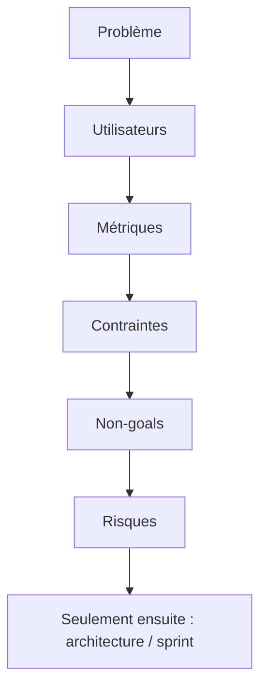

Utilisez ce outline dans Confluence, Notion, ou un fichier Markdown du repo. L'objectif est un **vocabulaire partagé** et des **hypothèses testables** avant l'architecture ou les engagements de sprint.

Si deux lecteurs ne sont pas d'accord sur ce que signifie « succès », arrêtez. Clarifiez le brief d'abord.

## L'outline d'une page

1. **Énoncé du problème** — douleur utilisateur + douleur business en un paragraphe. Pas de solution encore.
2. **Utilisateurs cibles** — personas ou segments + jobs-to-be-done principaux.
3. **Métriques de succès** — leading (activation, rétention) et lagging (revenu, NPS) avec cibles approximatives.
4. **Contraintes** — réglementaire, SLA, budget, timeline, dépendances d'autres équipes.
5. **Non-goals** — ce qui est explicitement hors scope pour cette phase. Dire non au scope creep tôt.
6. **Risques & questions ouvertes** — ce qui doit être validé avant le build ; qui possède chaque item de discovery.

## Comment l'utiliser en pratique

| Anti-pattern | Meilleur geste |
| --- | --- |
| Le brief est déjà un deck de slides avec diagrammes | Écrire le problème en une phrase que tout le monde peut citer |
| Métriques = vanity counts | Coupler leading + lagging avec owners |
| Section non-goals vide | Lister les trois features tentantes refusées cette phase |
| Risques possédés par « l'équipe » | Un nom par question ouverte |

<Callout variant="warning">
  Si le brief est déjà un deck de slides avec diagrammes, vous avez sauté la
  partie dure — écrire le problème en une phrase que tout le monde peut citer.
</Callout>

## Barre de qualité avant kickoff

- [ ] La phrase problème tient dans un message Slack sans perdre le sens
- [ ] Au moins une métrique leading et une lagging nommées
- [ ] Trois non-goals écrits (pas implicites)
- [ ] Chaque question ouverte a un owner et une date « decide by »
- [ ] Les contraintes incluent les ennuyeuses : conformité, settlement, charge support

## En résumé

L'architecture sans brief invente les requirements dans la pull request. Un brief d'une page coûte moins cher qu'un trimestre de thrash.

> **Si vous ne pouvez pas dire ce que vous ne construisez pas, vous n'avez pas décidé ce que vous construisez.**
