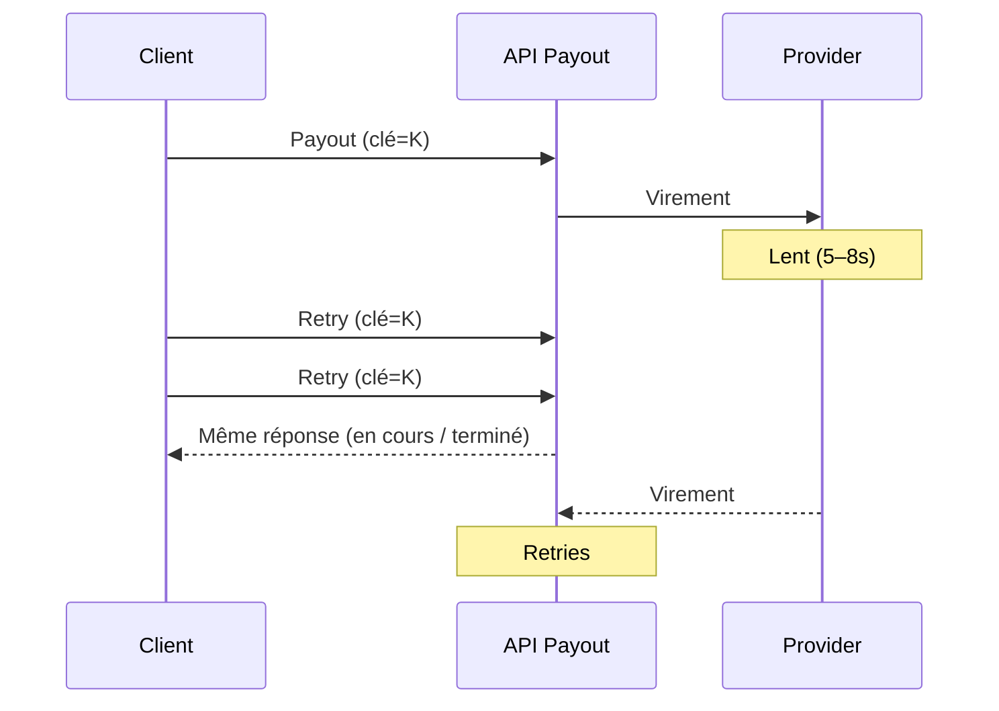

Un provider mobile money est devenu **lent, pas indisponible** — le pire type de panne. Les requêtes prenaient quatre, cinq, parfois huit secondes au lieu des quelques centaines de millisecondes habituelles.

Une intégration cliente avec une politique de retry trop gourmande s'est mise à renvoyer la même demande de payout après un timeout de trois secondes, persuadée que la première tentative avait échoué. Elle n'avait pas échoué. Elle était juste en retard.

## Ce qui s'est réellement passé

En environ quatre-vingt-dix secondes, la même commande de payout avait été soumise **trois fois** pour le même marchand. Côté fournisseur, les trois ont fini par réussir — trois virements distincts, même montant, même bénéficiaire.

Si le service de paiement avait traité chaque requête entrante comme une nouvelle commande, le compte du marchand aurait été crédité trois fois pour une seule vente. La finance l'aurait découvert lors du rapprochement de fin de journée — plusieurs jours plus tard — sans piste évidente vers la cause.

<Callout variant="warning">
  C'est le piège des retries sous latence, pas sous panne franche : tout
  signal qu'un client naïf observe (timeout, absence de réponse, connexion
  coupée) est indiscernable de « la requête n'est jamais arrivée ». En
  général, elle est bien arrivée. Elle n'avait juste pas encore répondu.
</Callout>

## Le seul contrôle qui a tenu la ligne

L'endpoint de payout exigeait une **clé d'idempotence** générée côté client, dérivée de l'ID marchand, de l'ID commande et du montant — pas un UUID aléatoire que la boucle de retry aurait pu régénérer à chaque tentative.

Les trois retries portaient la même clé. Le serveur a reconnu les deuxième et troisième appels comme des doublons d'une commande en cours, renvoyé la réponse d'origine, et n'a jamais émis de second virement.

| Conception de la clé | Sous tempête de retries |
| --- | --- |
| UUID aléatoire par tentative | Trois virements · incident finance |
| Hash stable de l'intention métier | Un virement · logs bruyants seulement |

Pas d'incident, pas de surprise en rapprochement, pas d'appel au marchand pour expliquer un remboursement. Juste une ligne de log un peu bruyante, trois requêtes de large, qu'un ingénieur a remarquée le lendemain matin par curiosité.

## Ce que « idempotent » doit vraiment dire

La leçon n'était pas « ajoutez des retries avec précaution ». C'était que l'idempotence doit se dériver de l'**intention métier** d'une commande, pas d'un identifiant côté client qu'un retry peut réinitialiser par accident.

Même règle que dans [systèmes fintech à l'échelle](/fr/articles/scalable-fintech-systems) et [quand SUCCESS n'est pas settled](/fr/articles/when-success-is-not-settled) : les retries sont inévitables ; une réponse réseau ambiguë n'autorise pas un second débit.

Si la clé peut changer entre deux tentatives, le filet de sécurité n'a jamais vraiment existé.

## En résumé

> **L'idempotence n'est pas un en-tête. C'est une clé métier qui doit survivre à chaque timeout, chaque retry et chaque client trop gourmand.**
