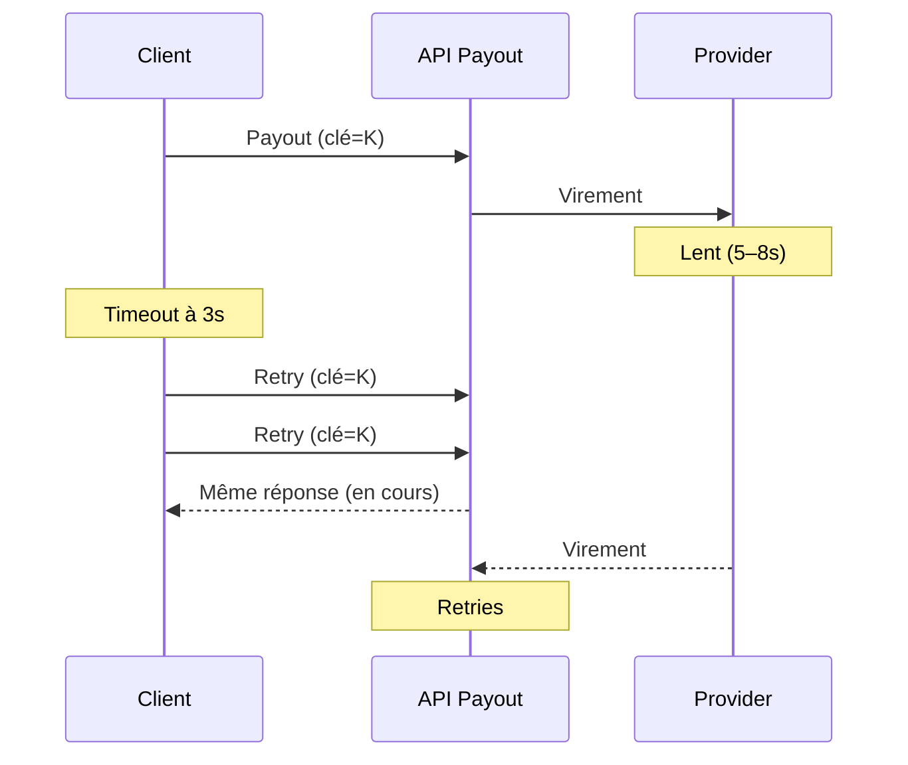

La finance n'a ouvert aucun ticket. Le support n'a pas appelé le marchand. La seule personne qui a vu quelque chose, c'est un ingénieur avec un café, devant une ligne de log large de trois requêtes.

C'est la version livrée. Le titre poli dit **deux fois**. Les logs ont dit **trois**.

[Le callback qui a dit `SUCCESS`](/fr/articles/when-success-is-not-settled) a menti avec un mot. Celui-ci a menti avec le silence.

## Jeudi, 16:47

Payout `PAY-33108` : **85 000 XOF**, un marchand, une commande. Le provider mobile money ne tombe pas. Il devient **lent** — quatre secondes, puis cinq, puis huit. Le temps habituel : quelques centaines de millisecondes. Le timeout du client : trois secondes.

À 16:47:03, le client décide que la première requête a échoué.

Elle n'avait pas échoué. Elle était encore en vol.

Le client renvoie le même payout. Puis encore.

## Ce que le client a cru vs ce qui était vrai

| Ce que le client a vu     | Ce qui se passait vraiment                 |
| ------------------------- | ------------------------------------------ |
| Timeout à 3 secondes      | Le premier virement rampait encore (5–8 s) |
| Aucune réponse            | Le provider était lent, pas down           |
| On peut retry sans risque | La première requête était déjà arrivée     |

En quatre-vingt-dix secondes, la même commande de payout a été soumise **trois fois**. Côté provider, les trois auraient abouti — trois virements distincts, même montant, même bénéficiaire, une seule vente.

La finance ne l'aurait pas vu cet après-midi-là. Elle l'aurait vu dans un fichier de fin de journée — ou des jours plus tard — sans piste vers un timeout de trois secondes.

<Callout variant="warning">
  C'est le piège des retries sous latence, pas sous panne franche. Tout signal
  qu'un client naïf observe — timeout, absence de réponse, connexion coupée —
  ressemble exactement à « la requête n'est jamais arrivée ». En général, elle
  est bien arrivée. Elle n'avait juste pas encore répondu.
</Callout>

## L'idée en une phrase

**Idempotent**, ça veut dire : envoyer deux fois la même commande d'argent, l'argent ne bouge qu'une fois.

Pas « l'API a un header ». Pas « on logue les doublons ». Le fait économique se produit **une seule fois**, même quand le réseau répond par un silence, un reset, ou un OK en retard.

La question d'entretien n'est pas de connaître le mot. C'est : **de quoi est faite la clé, et un retry peut-il la changer ?**

## Le seul contrôle qui a tenu

L'endpoint de payout n'acceptait pas un UUID aléatoire. Il exigeait une clé hashée à partir de **marchand + commande + montant** — l'intention métier, pas un ticket que la boucle de retry pouvait recréer à chaque tentative.

Les trois retries portaient la même clé. Le serveur a vu les appels deux et trois comme des doublons d'une commande déjà en vol, renvoyé la réponse d'origine, et n'a jamais émis de second virement.

| Comment on fabrique la clé        | Ce qu'une tempête de retries provoque                           |
| --------------------------------- | --------------------------------------------------------------- |
| Nouvel UUID à chaque tentative    | Trois virements. Incident finance. Appel au marchand.           |
| Hash stable de l'intention métier | Un virement. Un log bruyant. La finance n'entend jamais parler. |

| Qui            | Sans cette clé                                            | Avec                                     |
| -------------- | --------------------------------------------------------- | ---------------------------------------- |
| **Finance**    | Trois crédits pour une vente, trouvés au rapprochement    | Rien à expliquer                         |
| **Support**    | Un marchand qui demande pourquoi il a été payé trois fois | Aucun ticket                             |
| **Ingénierie** | Une revue d'incident                                      | Une ligne de log, lue le lendemain matin |

Pas de remboursement. Pas d'appel gênant. Juste un log un peu bruyant qu'un ingénieur a lu avec un café.

## Le vendredi qui aurait eu lieu

Si la clé avait été un UUID frais à chaque retry, le payout du jeudi aurait atterri trois fois. Le fichier de settlement du vendredi aurait été _trop beau_ — des crédits en trop, pas des lignes manquantes. Le produit aurait parlé de victoire. La finance, d'une fuite. Quelqu'un aurait été au téléphone avec le marchand, pour expliquer un remboursement sur de l'argent déjà dépensé.

Mêmes rails que le callback `SUCCESS`. Autre mensonge : pas un mot, un trou.

La leçon n'était pas « ajoutez des retries avec précaution ». C'était que l'idempotence doit se dériver de l'**intention métier** d'une commande, pas d'un identifiant côté client qu'un retry peut réinitialiser par accident.

Même règle que dans [systèmes fintech à l'échelle](/fr/articles/scalable-fintech-systems) : dix retries doivent égaler **une** intention économique. Si la clé peut changer entre deux tentatives, le filet de sécurité n'a jamais existé.

## En résumé

> **L'idempotence n'est pas un en-tête. C'est une clé métier qui doit survivre à chaque timeout, chaque retry et chaque client trop gourmand.**

## Le prochain schéma

Un mot a menti. Le silence a menti. Le prochain mensonge, c'est une boîte qui s'arrête trop tôt.

La clé de jeudi a sauvé un payout. Une gateway doit tenir la même règle à chaque étape : auth, capture, settlement, ledger, webhook, payout. Chacune peut timeout. Chacune peut retry. Chacune peut avoir l'air fini pendant que l'argent est encore en vol.

Les schémas d'entretien s'arrêtent à « appeler Visa ». L'argent se perd dans les interstices.

**[Du paiement carte au payout marchand →](/fr/articles/payment-gateway-system-design)**
