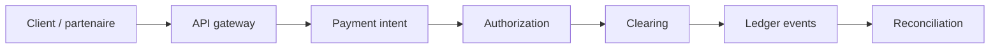

Les systèmes d'argent échouent cher : doubles débits, settlements ambigus, tableurs de réconciliation qui divergent de la base de vérité.

Le correctif n'est rarement pas une plus grosse base. Ce sont des frontières explicites entre **initiation**, **autorisation**, **clearing** et **réconciliation** — chacune avec ses invariants et sa piste d'audit.

## Frontière 1 : l'intent de paiement

Chaque mouvement d'argent commence comme une **commande**, pas un effet de bord. Le client possède une clé d'idempotence stable ; le serveur la traite comme clé métier unique — pas comme header optionnel.

Les retries sont inévitables. Dix retries doivent égaler **une** intention économique.

<CodeBlock title="Clé d'idempotence sur la commande d'écriture">{`import { randomUUID } from "node:crypto";

type CreatePayment = {
  amount: number;
  currency: string;
  /** Générée côté client ; les retries DOIVENT réutiliser la même clé */
  idempotencyKey: string;
};

export async function createPaymentIntent(cmd: CreatePayment) {
  const existing = await store.findByIdempotencyKey(cmd.idempotencyKey);
  if (existing) return existing;

  const intent = {
    id: randomUUID(),
    ...cmd,
    status: "requires_confirmation" as const,
  };
  await store.save(intent);
  return intent;
}`}</CodeBlock>

<Callout variant="info">
  Mettez l'idempotence dans le contrat OpenAPI et les tests d'intégration —
  pas seulement dans un commentaire. Loggez la clé à chaque retry avec des
  correlation IDs pour que le support suive une action utilisateur.
</Callout>

## Frontière 2 : autorisation vs exécution

L'autorisation répond « ce mouvement est-il permis ? » L'exécution répond « le rail l'a-t-il accepté ? » Les mélanger produit des faux verts : l'app affiche payé alors que le provider traite encore.

Gardez la policy déterministe, indépendante de l'optimisme UI. Une réponse PSP ambiguë déclenche un **status check**, jamais un second débit.

## Frontière 3 : le ledger comme source de vérité

Si la finance ne peut pas expliquer votre modèle de ledger en une session tableau blanc, les ops paieront la taxe pour toujours.

Préférez des événements append-only. Rendez « pourquoi ce montant est-il là ? » répondable depuis les données. Les tables de solde mutable sont acceptables comme **projections** — dangereuses comme seul enregistrement. Voir l'[ADR double-entry ledger](/articles/adr-double-entry-ledger-payments).

| Couche | Possède | Ne doit pas posséder |
| --- | --- | --- |
| Intent API | Commandes, idempotence | Vérité finale de settlement |
| Adapter provider | Mapping, retries, HMAC | Policy métier |
| Ledger | Événements économiques postés | Copy UX |
| Réconciliation | Écarts et orphelins | Inventer de l'argent |

## Frontière 4 : la réconciliation comme produit

La réconciliation n'est pas une corvée de fin de mois. C'est la boucle de feedback qui prouve que vos états collent à la réalité.

- **Hot path** — poller les intents au-delà du SLA provider.
- **Batch quotidien** — matcher fichiers de settlement et écritures.
- **File manuelle** — les `UNKNOWN` ne passent jamais en auto-success.

## En résumé

Le scale horizontal sans ces frontières accélère juste l'argent en double et les threads Slack plus bruyants.

> **Un système fintech scalable est celui où chaque franc peut s'expliquer — qui l'a ordonné, qui l'a autorisé, quel rail l'a touché, et quelle ligne de journal le prouve.**
