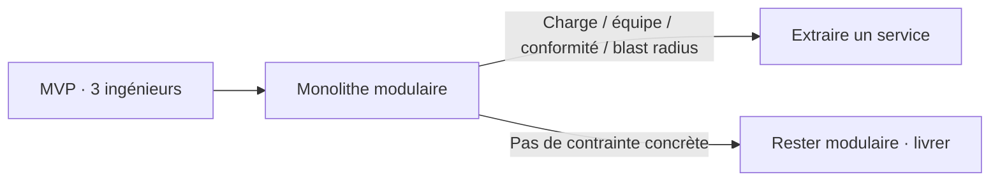

Un pitch d'architecture sur deux pour une nouvelle MVP fintech dans la région commence par un diagramme de services : service auth, service paiement, service notifications, un bus de messages entre les trois, chacun avec sa propre base et son propre pipeline de déploiement.

L'équipe derrière compte en général **trois ingénieurs et personne dédié aux ops**. Ce diagramme n'est pas une architecture — c'est une liste de souhaits pour une entreprise qui n'existe pas encore.

## D'où vient ce réflexe

Le microservices-first est une réponse raisonnable à un problème que la plupart des jeunes fintechs de la région n'ont pas encore : des centaines d'ingénieurs qui doivent déployer indépendamment sans se marcher dessus.

Copier cette structure à trois ingénieurs en importe les coûts :

| Coût importé | Ce que vous aviez avant |
| --- | --- |
| Appels réseau | Appels de fonction |
| Transactions distribuées | Transactions base de données |
| Trois alertes à 2h | Un process, un modèle mental |
| Pipelines de deploy par service | Un seul train de release |

<Callout variant="info">
  La question n'est jamais « monolithe ou microservices » dans l'abstrait.
  C'est : qui est d'astreinte ce soir, et combien de domaines de panne
  indépendants cette personne peut-elle vraiment gérer à 2h du matin ?
</Callout>

## Ce qui justifie vraiment la scission

Extrayez un module quand une **contrainte concrète** l'impose — pas un article de blog sur Netflix :

1. Un module a un **profil de charge** réellement différent — par ex. l'ingestion de webhooks doit scaler indépendamment du dashboard admin.
2. Deux équipes doivent livrer et déployer ce module sur des **calendriers séparés** sans coordonner une release.
3. Un composant a des exigences de **conformité ou de résidence des données** différentes du reste du système.
4. Le **rayon d'impact** d'une panne du module doit être contenu — un job de reporting qui plante ne doit jamais entraîner les paiements avec lui.

## Commencer modulaire, pas distribué

Des frontières de modules claires, un seul déployable, une seule base, des interfaces internes assez strictes pour qu'extraire un module plus tard soit un **refactor, pas une réécriture**.

Compatible avec la discipline monétaire ailleurs sur ce blog — [intentions de paiement idempotentes](/fr/articles/scalable-fintech-systems), [exactitude du grand livre](/fr/articles/adr-double-entry-ledger-payments) — aucune n'exige douze repos dès le jour un.

## En résumé

Aucun des critères valides n'est « on a lu un article sur Netflix ». Scindez quand une contrainte concrète l'impose, pas avant.

> **L'équipe qui résiste au diagramme aujourd'hui est en général celle qui livre encore dans dix-huit mois.**
