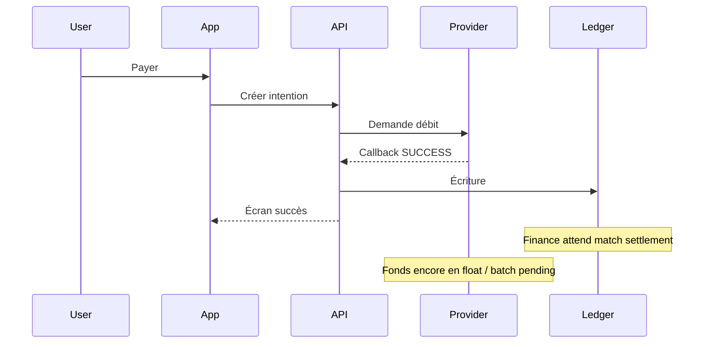
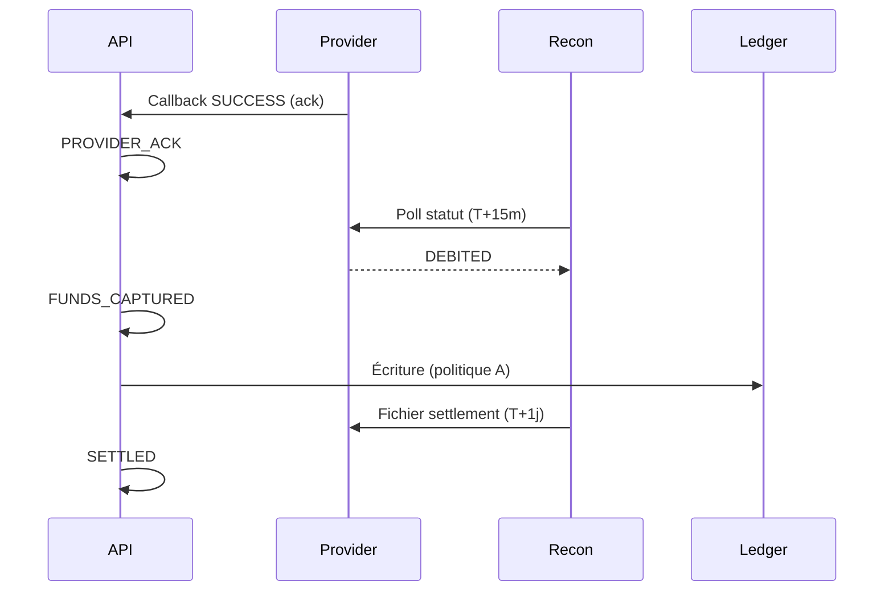

La finance ouvre le fichier de settlement lundi matin. Trois lignes du lot mobile money de vendredi ne correspondent pas au grand livre. Le support a déjà clos les tickets — l'app affichait **Paiement réussi**. Le produit demande pourquoi l'ops « rouvre » un lancement au vert.

Le fournisseur ne mentait pas. Votre système a mappé **`SUCCESS` à réglé** alors que le fournisseur voulait seulement dire **accepté pour traitement**.

C'est l'écart de rapprochement le plus fréquent en audit fintech ouest-africain. Suite directe des [patterns d'intégration mobile money](/fr/articles/mobile-money-integration-patterns) : mêmes rails, vocabulaire plus précis.

## Trois sens cachés dans un mot

Sur le papier, chaque fournisseur expose quelque chose comme `SUCCESS`, `FAILED` ou `PENDING`. En production, les équipes découvrent au moins trois moments distincts :

| Moment       | Ce que le fournisseur veut souvent dire      | Ce que la finance entend                   |
| ------------ | -------------------------------------------- | ------------------------------------------ |
| **Accepté**  | Requête reçue ; le débit peut encore échouer | Rien — ne pas reconnaître le revenu        |
| **Confirmé** | Wallet utilisateur débité ; fonds en float   | Passif qui bouge ; pas encore réglé banque |
| **Réglé**    | Fichier batch / virement banque a bouclé     | Correspondance ligne à ligne au rapport    |

Wave, Orange Money et Free Money n'utilisent pas les mêmes libellés. Certains envoient `SUCCESS` au premier callback sans second envoi. D'autres envoient `COMPLETED` des jours plus tard dans un CSV. Quelques-uns exposent une API où `SUCCESS` retourne encore `settlementStatus: PENDING`.

Si votre modèle domaine n'a qu'un booléen — `isSuccessful` — vous finirez par mentir à au moins une audience.

## La séquence que la plupart des équipes supposent



Le bug n'est pas le callback. C'est **poster au grand livre sur la mauvaise transition**.

## Scinder vos états avant vos adaptateurs

Remplacez un seul `SUCCESS` par un vocabulaire interne qui survit aux renommages fournisseur :

```text
INITIATED → SENT_TO_PROVIDER → PROVIDER_ACK → FUNDS_CAPTURED → SETTLED
                                      ↘ FAILED
                                      ↘ EXPIRED / UNKNOWN (rapprochement)
```

Règles valables quel que soit le fournisseur :

1. **Copie utilisateur** suit `PROVIDER_ACK` ou `FUNDS_CAPTURED` — jamais `SETTLED` sauf si vous pouvez le défendre devant la finance.
2. **Écritures grand livre** à `FUNDS_CAPTURED` (wallet débité) ou `SETTLED` (batch clos) — une politique, documentée en ADR. Mélanger les deux sans noms, c'est la source des litiges.
3. **Jobs de rapprochement** comblent l'écart entre `FUNDS_CAPTURED` et `SETTLED` ; ils n'inventent pas d'argent.

<CodeBlock title="Handler callback — mapper le code fournisseur, ne pas le copier">{`public enum InternalPaymentState {
  INITIATED, SENT, PROVIDER_ACK, FUNDS_CAPTURED,
  SETTLED, FAILED, EXPIRED
}

public PaymentIntent handleCallback(CallbackPayload payload) {
PaymentIntent intent = loadOrThrow(payload.getReference());

if (intent.isTerminal()) {
return intent; // no-op idempotent
}

ProviderStatus mapped = adapter.mapStatus(payload.getCode());

switch (mapped) {
case ACCEPTED -> intent.transition(PROVIDER_ACK);
case DEBITED -> intent.transition(FUNDS_CAPTURED);
case SETTLED -> intent.transition(SETTLED);
case FAILED -> intent.transition(FAILED);
default -> auditLog.unknown(payload);
}

auditLog.record(intent, payload.getRawBody());
return repository.save(intent);
}`}</CodeBlock>

<Callout variant="warning">
  Ne mettez pas `settledAt` sur `PROVIDER_ACK`. Si votre ORM n'a qu'un
  timestamp, renommez en `providerAckAt` ou scindez les colonnes maintenant —
  avant que la finance n'exporte avec la mauvaise sémantique.
</Callout>

## Table d'adaptation par fournisseur (gardez-la simple)

Maintenez une table de mapping explicite — versionnée, revue quand les docs changent sans annonce :

| Champ fournisseur                   | Votre état         | Écriture grand livre ? | « Succès » utilisateur ? |
| ----------------------------------- | ------------------ | ---------------------- | ------------------------ |
| `status=SUCCESS` (callback v1)      | `PROVIDER_ACK`     | Non                    | « En cours »             |
| `status=COMPLETED`                  | `FUNDS_CAPTURED`   | Oui (politique A)      | « Payé »                 |
| Ligne settlement présente           | `SETTLED`          | Oui (politique B)      | inchangé                 |
| API statut `PENDING` après callback | rester / `UNKNOWN` | Non                    | « En cours »             |

Politique A vs B est une décision métier. L'exigence technique : **un choix documenté**, pas un mélange implicite par sprint.

## Ce que chaque équipe doit voir

**Support** — référence fournisseur, état interne, heure du dernier callback — pas une coche verte empruntée à l'app.

**Finance** — rapport indexé sur `SETTLED` (ou votre point de reconnaissance) avec id batch fournisseur.

**Analytics produit** — entonnoir sur `FUNDS_CAPTURED` si c'est la fin de l'expérience utilisateur — mais libellé honnête dans la légende du dashboard.

Quand ces vues divergent, les incidents passent de « qui a cassé la prod ? » à « quel état est bloqué ? » — la différence entre une semaine d'archéologie Slack et un rapprochement ciblé.

## Le rapprochement boucle le cycle

Planifiez trois niveaux (depuis l'[article patterns](/fr/articles/mobile-money-integration-patterns)) :

- **Chemin chaud** — toutes les 5 minutes, poll statut pour intentions en `PROVIDER_ACK` ou `FUNDS_CAPTURED` au-delà du SLA fournisseur.
- **Batch quotidien** — comparer lignes fichier settlement à `SETTLED` ; alerter sur orphelins dans les deux sens.
- **File manuelle** — `UNKNOWN` après N polls ; jamais d'auto-success.



## Checklist avant le prochain fournisseur

- [ ] Enum d'états interne revue avec la finance — pas seulement le backend
- [ ] Table mapping adaptateur dans le repo, pas dans la tête d'un ingénieur
- [ ] Copie utilisateur testée pour `PROVIDER_ACK` vs `SETTLED`
- [ ] ADR grand livre indique quelle transition poste les écritures
- [ ] Alertes rapprochement sur `FUNDS_CAPTURED` bloqué, pas seulement `PENDING`
- [ ] Id de corrélation sur callback, poll et ligne settlement

<Callout variant="info">
  Réflexion liée : [La solitude de l'ingénieur
  paiement](/fr/articles/loneliness-of-the-payment-engineer) — pourquoi ce
  travail de vocabulaire reste invisible jusqu'au sixième mois.
</Callout>

---

**Études de cas :** [SDK Paiement Pan-Africain](https://saifcore.tech/fr/systems) et [grand livre partie double](https://saifcore.tech/fr/systems) sur le portfolio. Bloqué entre docs fournisseur et rapports finance ? [Réserver un audit architecture 30 min](https://saifcore.tech/fr#contact).
