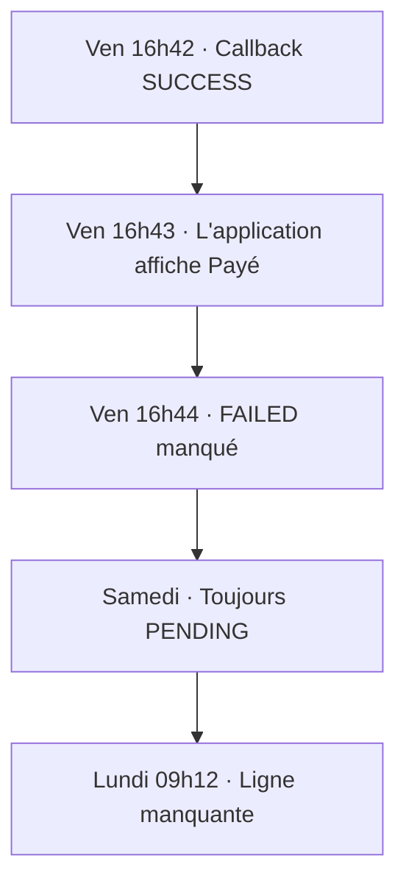
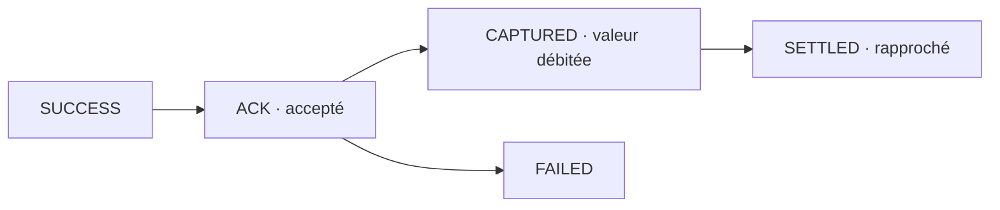

La finance ouvre le fichier de settlement lundi matin. Trois lignes du lot mobile money de vendredi ne correspondent pas au grand livre. Le support a déjà clos les tickets — l'app affichait **Paiement réussi**. Le produit demande pourquoi l'ops « rouvre » un lancement au vert.

Le fournisseur ne mentait pas. Votre système a mappé **`SUCCESS` à réglé** alors que le fournisseur voulait seulement dire **accepté pour traitement**.

C'est l'écart de rapprochement le plus fréquent en audit fintech ouest-africain. Suite directe des [patterns d'intégration mobile money](/fr/articles/mobile-money-integration-patterns) : mêmes rails, vocabulaire plus précis.

## Trois sens cachés dans un mot

Sur le papier, chaque fournisseur expose quelque chose comme `SUCCESS`, `FAILED` ou `PENDING`. En production, les équipes découvrent au moins trois moments distincts :

| Moment       | Ce que le fournisseur veut souvent dire      | Ce que la finance entend                   |
| ------------ | -------------------------------------------- | ------------------------------------------ |
| **Accepté**  | Requête reçue ; le débit peut encore échouer | Rien — ne pas reconnaître le revenu        |
| **Confirmé** | Wallet utilisateur débité ; fonds en float   | Passif qui bouge ; pas encore réglé banque |
| **Réglé**    | Fichier batch / virement banque a bouclé     | Correspondance ligne à ligne au rapport    |

Wave, Orange Money et Free Money n'utilisent pas les mêmes libellés. Certains envoient `SUCCESS` au premier callback sans second envoi. D'autres envoient `COMPLETED` des jours plus tard dans un CSV. Quelques-uns exposent une API où `SUCCESS` retourne encore `settlementStatus: PENDING`.

Si votre modèle domaine n'a qu'un booléen — `isSuccessful` — vous finirez par mentir à au moins une audience.

## La séquence que la plupart des équipes supposent

```mermaid
flowchart TB
  A["Ven 16h42 · Callback SUCCESS"] --> B["Ven 16h43 · L'application affiche Payé"]
  B --> C["Ven 16h44 · FAILED manqué"]
  C --> D["Samedi · Toujours PENDING"]
  D --> E["Lundi 09h12 · Ligne manquante"]
```

## Lundi, 09h12

La finance ouvre le fichier batch. `OM-88421` ne s'y trouve pas.

Voici ce que le week-end a masqué. Vendredi 16h44, un callback `FAILED` a quitté le provider. Votre endpoint était saturé : il n'est jamais arrivé. Samedi, l'API de statut répondait encore succès — règlement toujours en attente. Personne côté ops n'a vérifié — le ticket était déjà au vert.

Trois systèmes, trois vérités. L'application indique payé. Le provider indique pending. La banque n'indique rien. Les 15 000 XOF n'ont jamais bougé.

Pas une panne : un mot qui signifiait _accepté_, stocké comme _confirmé_, reporté comme _settled_.

<Callout variant="warning">
  Les providers ne partagent pas le même dictionnaire. Un `SUCCESS` peut
  signifier une requête acceptée chez l'un, une transaction réussie chez
  l'autre, ou n'être qu'un état intermédiaire dans un troisième système. Le mot
  n'est pas le moment.
</Callout>

## Arrêtez de recopier le mot

Le premier `SUCCESS` est un **ACK** : la requête a été prise en compte. En cours de traitement. Pas Payé.

Un statut provider n'est donc pas un statut métier. C'est un événement à interpréter.

Ce ne sont pas trois traductions du même mot. Ce sont trois faits différents :

**ACK** — le provider a reçu ou accepté la demande.
**CAPTURED** — la valeur a effectivement été débitée ou créditée sur le rail.
**SETTLED** — la transaction est reconnue dans le règlement ou le rapprochement.
**FAILED** même si un callback antérieur annonçait un succès.

```mermaid
flowchart LR
  CB["SUCCESS"] --> ACK["ACK · accepté"]
  ACK --> CAP["CAPTURED · valeur débitée"]
  CAP --> SET["SETTLED · rapproché"]
  ACK --> FAIL["FAILED"]
```

Exposez ACK ou CAPTURED à l'utilisateur. Écrivez au ledger à CAPTURED ou à SETTLED — **une seule politique, formellement documentée**. Mélangez les deux, et le lundi matin recommence. Le rapprochement comble un écart ; il ne crée pas de francs.

Ne posez jamais `settledAt` sur le premier callback. Le handler qui mappe au lieu de recopier est détaillé dans [les patterns d'intégration mobile money](/fr/articles/mobile-money-integration-patterns).

## Le lundi qui aurait dû arriver

Si le `SUCCESS` de vendredi était devenu ACK, l'application aurait affiché _En cours_. Le support aurait vu une intention active. Le `FAILED` manqué serait remonté au poll suivant. Et le fichier du lundi aurait été fidèle : aucune ligne, parce que rien n'avait été capturé.

La finance n'aurait pas cherché un fantôme dans un lancement au vert. Elle aurait traité un paiement bloqué.

Mêmes rails. Même callback. Dictionnaire différent.

> **Un callback est une phrase dans la langue du provider. Votre architecture doit la traduire avant qu'elle ne devienne un fait financier.**

## Le mensonge suivant

`SUCCESS` était le premier mensonge. Le suivant sera un silence.

Le provider n'est pas tombé : il est devenu lent. Trois secondes de silence — assez pour qu'un client impatient relance, puis relance encore. Même marchand, même montant, trois virements en vol.

Quatre-vingt-dix secondes avant un double paiement.

**[Ce qui l'a arrêté →](/fr/articles/retry-storm-double-payout)**
