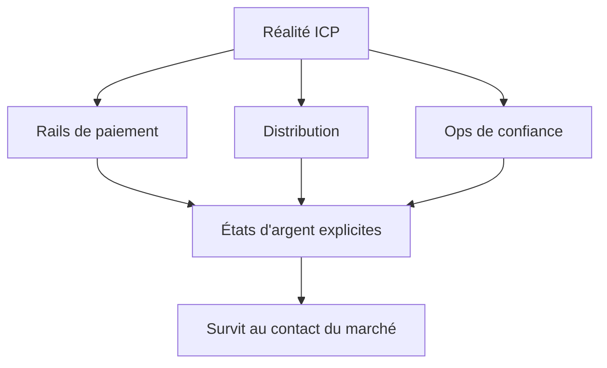

Une recette pensée pour des économies carte-first, une logistique same-day et un change stable vous induira en erreur dès que vous optimisez pour un marché où l'**argent mobile**, les **réseaux d'agents** et le **liquide** structurent encore le comportement.

Ce n'est rarement pas la roadmap qui lâche en premier. C'est la stack invisible autour : comment l'argent circule, comment on tranche un litige, comment on gagne la confiance sans dix ans de notoriété.

## Le piège du copier-coller

Les équipes qui « copient San Francisco » sous-pondèrent le dernier kilomètre :

| Hypothèse qui voyage mal | Ce que vous rencontrez vraiment |
| --- | --- |
| La carte est le défaut | Mobile money, USSD, cash-in agent |
| Settlement same-day | Float, fichiers de lot, latence corridor |
| KYC uniforme | Règles selon pays et partenaire |
| `SUCCESS` = payé | Souvent accepté, pas encore settled |
| Support = chat | Agents et ops terrain ferment la boucle |

Les APIs partenaires renvoient un succès alors que le portefeuille est encore pending. Les fenêtres de settlement refusent de coller à la paie. Votre architecture doit rendre ces états **visibles** — pas les masquer derrière un spinner générique.

## Trois modes d'échec qui tuent la traction

### 1. Les paiements comme feature, pas comme système

Si votre runbook « paiement bloqué » est un ping Slack vers un humain, vous n'avez pas encore une architecture de paiement. Vous avez un script.

Concevez pour :

- initiation idempotente
- callbacks vérifiés
- jobs de réconciliation
- statut client que la finance peut défendre

### 2. Distribution ignorée jusqu'à la croissance

Dans beaucoup de corridors, la distribution *est* le produit : agents, agrégateurs, partenariats telco, réseaux informels. Un beau dashboard sans chemin vers l'acheteur est une démo, pas un business.

### 3. Confiance supposée, pas conçue

Sans gravité de marque, la confiance est opérationnelle : statut clair, settlement prévisible, litiges qui fonctionnent quand le réseau flanche. Les entonnoirs flous masquent des écarts structurels qu'aucun feature flag ne réparera.

<Callout variant="warning">
  Instrumentez l'adoption et les échecs comme vous instrumentez le revenu.
  Si vous ne mesurez que les « comptes activés », vous manquerez le corridor
  où l'argent n'atterrit jamais.
</Callout>

## Sur quoi concevoir à la place

Partez de contraintes observables :

1. **Quels rails** votre ICP utilise vraiment — pas ceux que vos investisseurs préfèrent.
2. **Ce que signifie une « bonne » latence** en 3G et couverture intermittente.
3. **Quels artefacts de conformité** les auditeurs exigeront en année deux, pas au pitch.
4. **Quels états** finance, support et produit doivent partager — voir [le callback qui a dit SUCCESS](/fr/articles/when-success-is-not-settled).

## En résumé

L'objectif n'est pas de romanticiser la complexité locale. C'est de bâtir des systèmes assez honnêtes pour dégrader proprement quand le réseau capricie, que la réglementation pivote, ou que votre sponsor quitte le compte.

> **Un SaaS qui tient en Afrique n'est pas celui au pitch le plus propre. C'est celui dont les hypothèses d'argent, de distribution et de confiance survivent au premier contact.**

Votre architecture actuelle resterait-elle crédible si le settlement prenait trois jours et que le callback n'arrivait jamais ?
